+++
title = 'En Svensk Sommar'
date = 2022-07-15T00:00:00+00:00
draft = false
featured_image = "Fina-bjursskjortan-pa-liten-DSC_2512.jpg"
+++

 Jo, jag vet att det här skall handla om Bangalore, men först en liten bild av årets sommar. Vad vi gjorde, och hur vi såg ut, innan.
 

## Sommaren 2022

 Sommaren rivstartade med ett besök på Legoland. På resan dit tog Nils chansen att prova på att vara YouTuber.
 

 Sverige passade på att ge oss en föraning av den tropiska upplevelsen med en av de varmaste midsommarveckorna på en livstid.
 

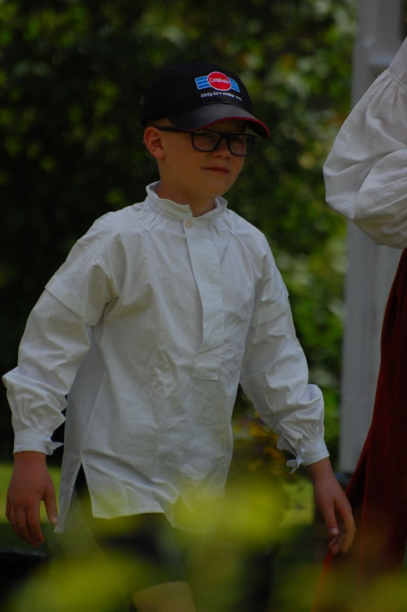

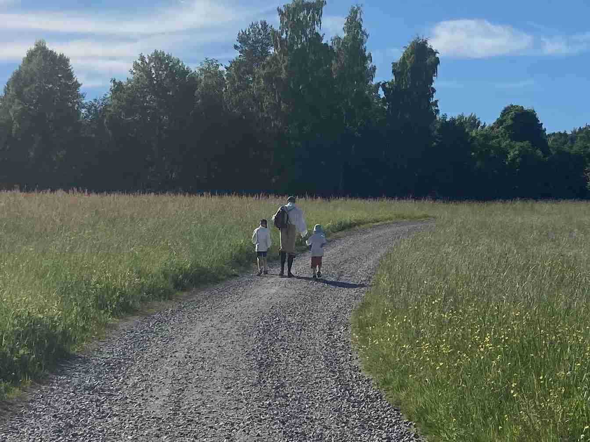

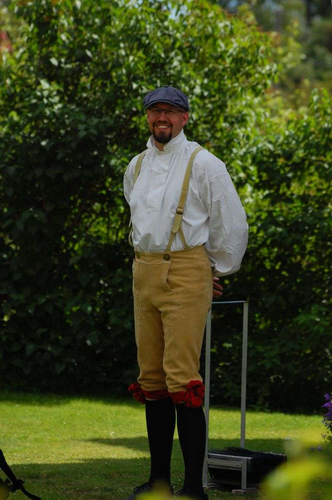

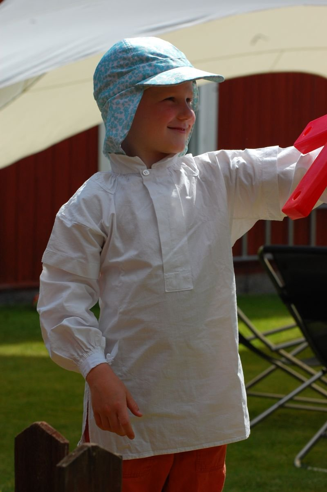

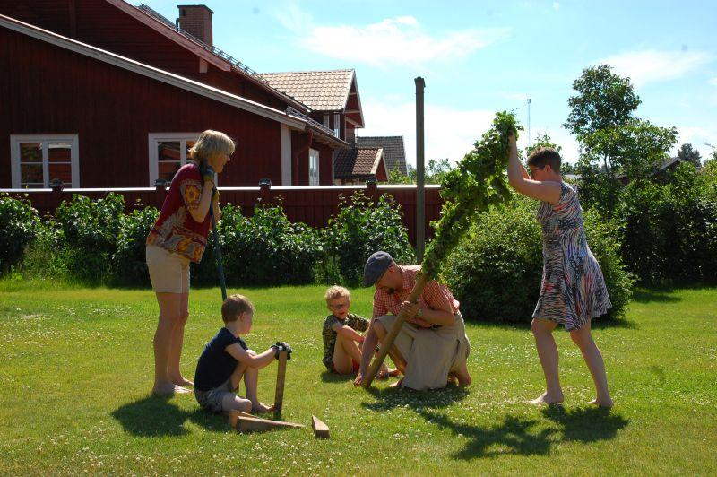

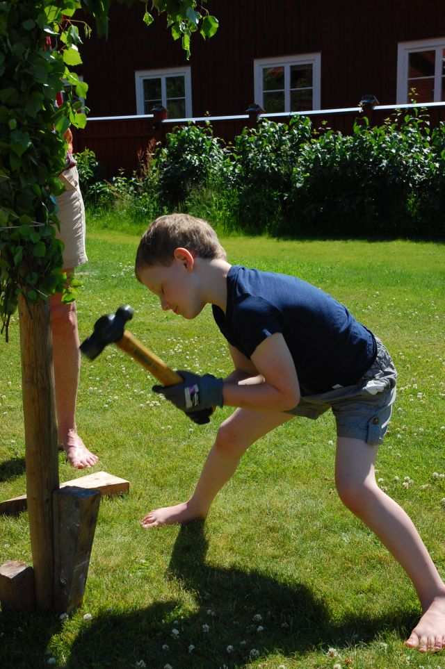

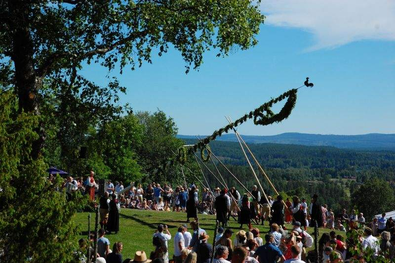

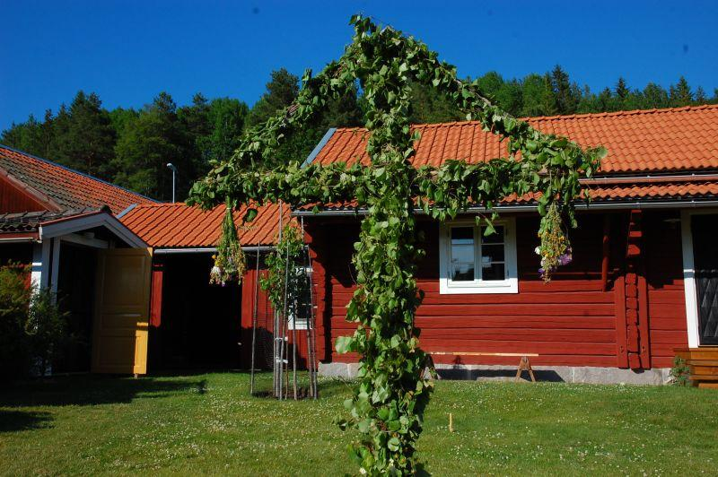

 Midsommar följdes av kanotpaddling på Voxnan.
 

## Elevhandboken

 Vi fick också Trios elevhandbok. Den var mycket intressant läsning. Visst blev det tydligt att vi reser till ett lite mer patriarkalt land när man såg vissa detaljer, men det som verkligen blev tydligt var på hur pass stort allvar denna skola tar sitt jobb och ansvar.
 

 Så inte helt oväntat började det med tydliga förhållningsregler för elverna. Men sedan följde en väldigt tydlig beskrivning av vad skolan kommer göra om dessa regler bryts. Sedan följde direkt vilka förhållningsregler eleverna kan vänta sig att personalen skall följa, och vad de kan göra om de upplever att personalen brister. Men inte nog med det. Samma tydlighet gäller mot föräldrar, inklusive en tydlighet mot den stereotypa föräldern som inte kan bete sig civiliserat när ungdomarna tävlar i idrott. Så bilden av en skola med tydliga hierarkier framträder, men de där bra dubbelriktade hierarkierna där varje nivå har förväntningar på sig både uppifrån och nerifrån. Och det är något jag inte mött så ofta.
 

 Men det riktiga uppvaknandet fick jag när jag läste om deras policy kring telefoner och sociala medier. De hänvisar till studier som visar att sociala medier i allmänhet och smarta telefoner i skolan i synnerhet inte förbättrar studiemiljön och därför är de inte tillåtna. Ingen elev får ha en smart telefon i skolan, alls. Och ingen elev får ha konton på sociala medier, överhuvud taget. Har man Facebook-konto och vill börja på Trio som elev i motsvarande låg- och mellanstadier, så får man vackert stänga ner sitt konto. Ord och inga visor.
 

 Och allt jag känner, är ett inre lugn.
 

## Sista dygnet hemma

 Sommaren avslutades med ett besök hos vänner som fortfarande har stationära gamingdatorer. Så barnen fick lära sig hur man spelar datorspel på ”riktigt”. Nils hade dessutom den goda smaken att börja spela det bästa spel som någonsin gjorts.
 

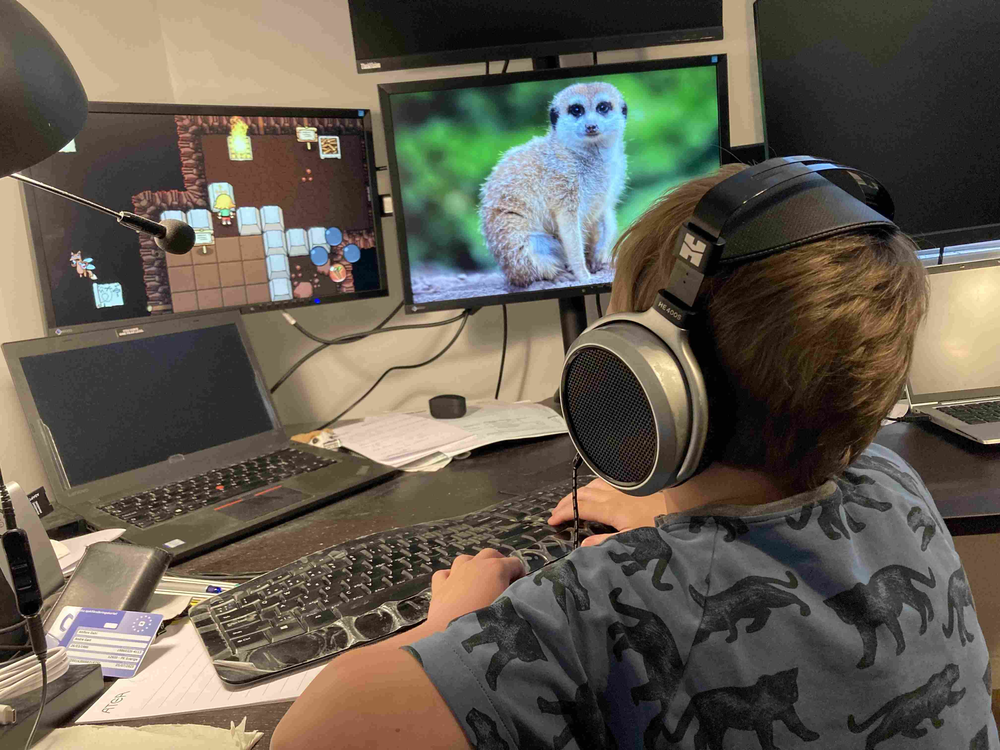

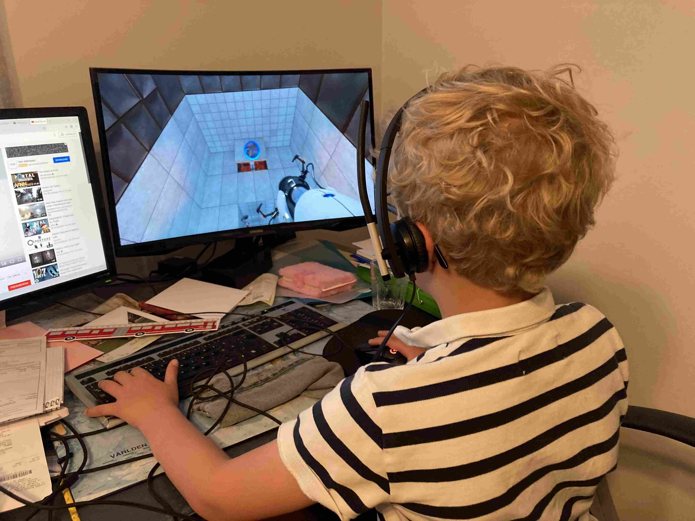

 Men nu har vi tömt lägenheten och kastat ner den sista nyckeln i brevinkastet. Incheckade och klara så är vi nu tryggt installerade på hotellet på Arlanda. Om drygt 24 timmar så landar vi förhoppningsvis i Bangalore.
 

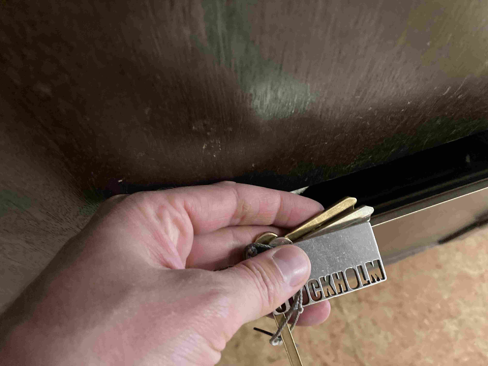

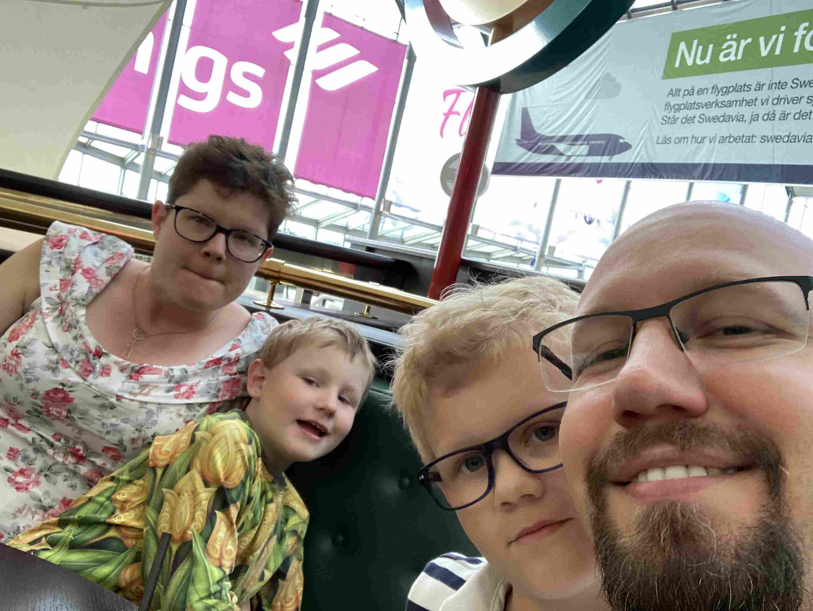

