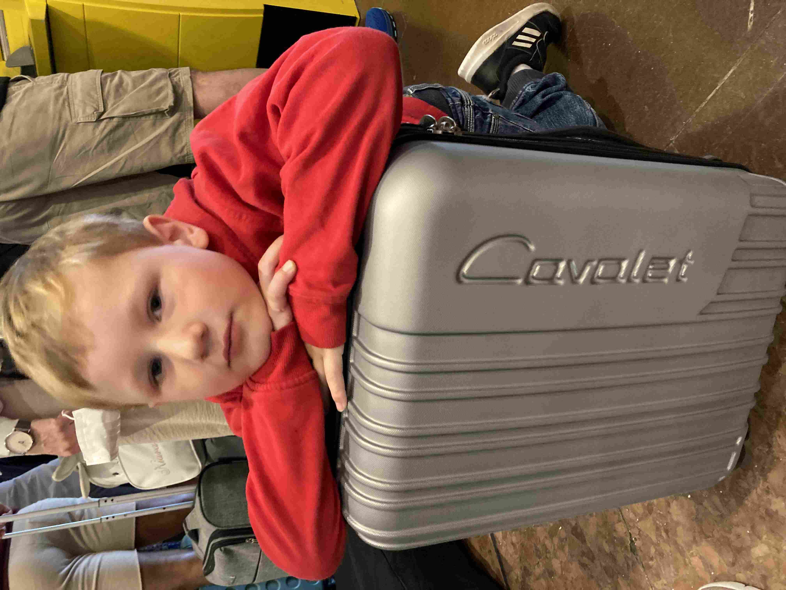
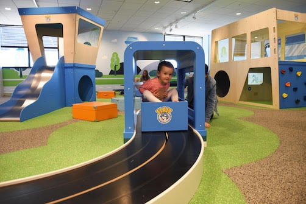
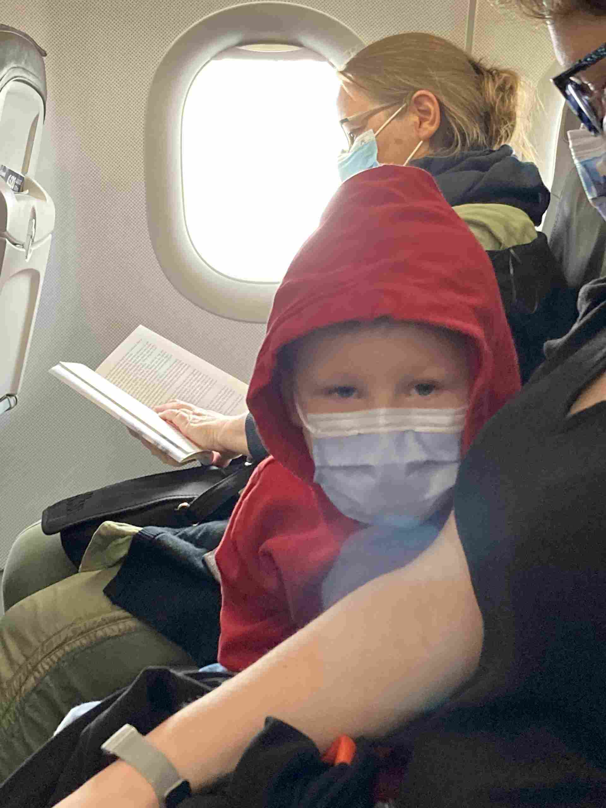
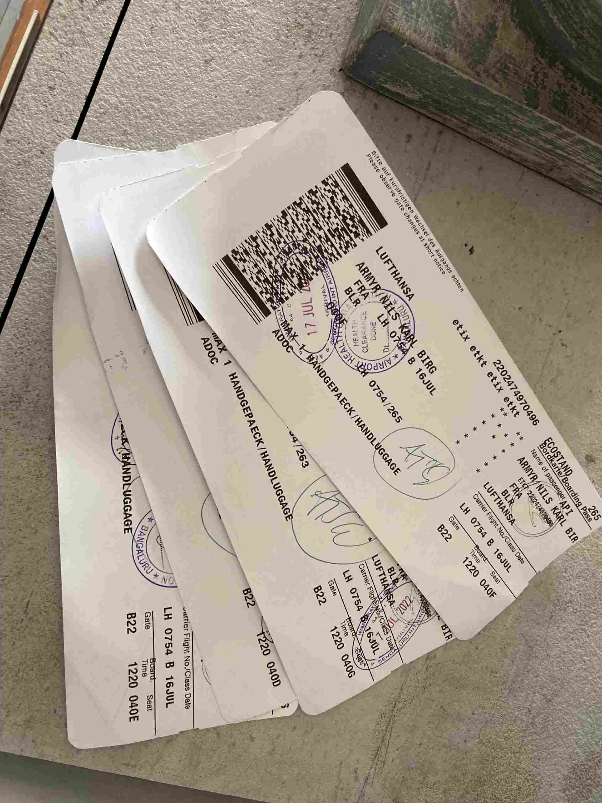
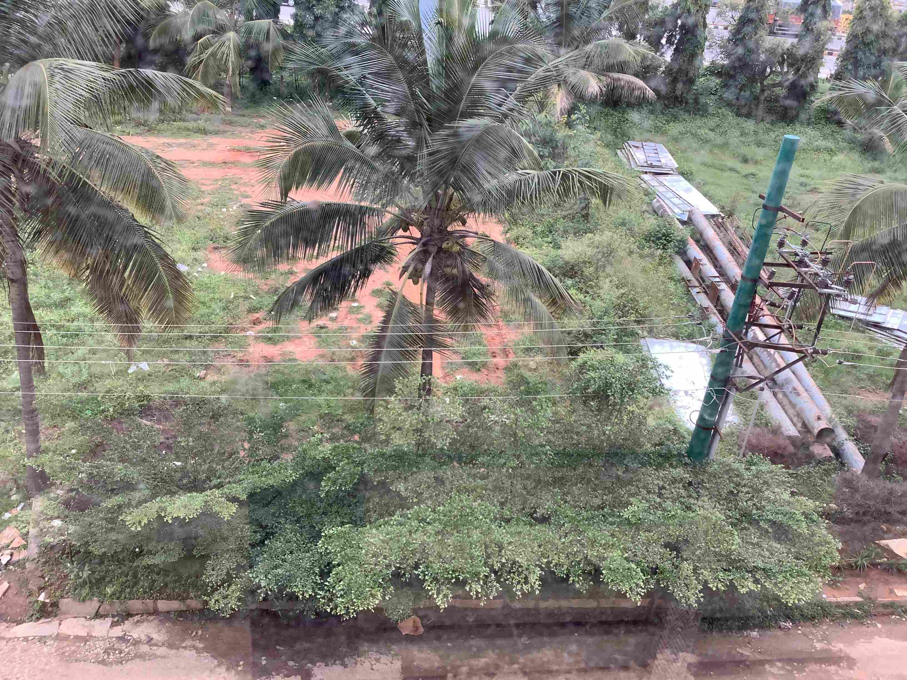

+++
title = 'Da Var Vi Framme'
date = 2022-07-17T00:00:00+00:00
draft = false
featured_image = "IMG_2756.jpeg"
+++

 Med varierande mängd fjärilar i magen så vaknade vi i går morse på Arlandas hotell. Nyheterna har ju varit fyllda av skräckhistorier om flera timmar långa köer till säkerhetskontrollen, men just denna morgon så rapporterade flygplatsappen glatt en kötid på mellan 0 och 2 minuter. Så det blev en lugn, om än inte så stor frukost. Något som skulle sätta tonen för resten av resan.
 

 När vi väl kommit genom säkerhetskontrollen så hade vi precis lagom med tid att leka lite i lekplatsen inne på terminal 5. Guldtstjärna för att de byggd en leksak där man kan åka i en låda genom en tunnel som såg ut som en väskscanner. Få saker gör mig så glad som en lekplats där man ser att de som byggde den tänkte till ett varv extra. Och själv han jag med ett yoga-pass.
 

 Det blev på fet hela taget en ganska händelselös resa, men när vi väl lämnade Frankfurt för den sista etappen till Bangalore, då blev till slut hela detta äventyr på riktigt för några av oss.
 

 Själv tänkte jag: Skall vi alltså faktiskt bo i Bangalore i ett helt år? Det är ju galet! Vem kommer ens på något sådant?
 

 Också Nils kände att kombinationen av att vara i en liten plåtburk flera tusen meter upp i luften, tillsammans med idén om att lära sig ny stad, nytt språk, nytt skolsystem och allt annat inte riktigt bäddade för en stor aptit.
 

 Här hjälpte inte Lufthansa till direkt heller. Normalt så daltar vi inte med barnens mat, men denna gång hade vi specifikt beställt “barnmat” till barnen. Då hade vi räknat med något där ingredienserna inte var så blandade, beska smaker undviks och maten mest består av raffinerat vete och lättuggat kött. Nejnej. Salladswrap skall de äta! Linsgryta, ris med kryddor och nötter i, pasta som blandats med båda majonnäs och gelé(!?). Samt grovt och segt gramhamsbröd. Nåja, gummibjörnar och läsk håller också blodsockret uppe.
 

 Bangalores flygplats räddade upp situationen med trevligt personal, inga köer där heller, en Pizza Hut precis vid utgången, och en trevlig och välfungerande taxi-service. Så snart nog var vi mätta och på hotellet.
 

 Nu är klockan 13.08 lokal tid. Hittills har halva familjen vaknat (Gissa vilken halva 😀 ) och det finns en McDonald’s på gångavstånd. Efter gårdagens äventyr så tar vi det lite lugnt med kulturkrockarna idag.
 

 Utsikt från hotellfönstret. Fotat av Nils.
 

 I morgon tar vi sista steget på resan och flyttar in i lägenheten.
 

