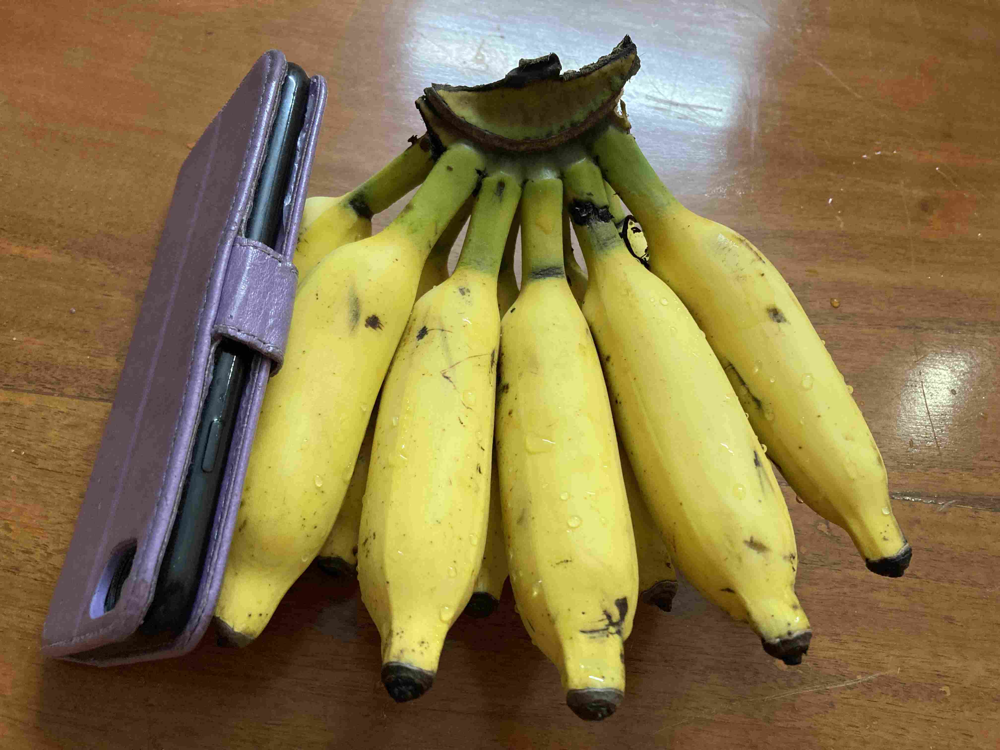

+++
title = 'Andra Dagen I Bangalore'
date = 2022-07-18T00:00:00+00:00
draft = false
featured_image = "IMG_2782.jpeg"
+++

 I Indien är alla jättetrevliga och hjälpsamma. Och allting blir faktiskt gjort, bara lite långsammare än i BankID-Sverigen.
 

 Så det blev en ganska lång väntan på att en chef skulle dyka upp på mobilbutiken för att kunna skriva in manuella papper då det nya digitala systemet de har inte funkar med Europeiska pass. Chipspåsar kostar 1kr, så vi hade det ganska trevligt ändå. Vi har fått det bekräftat och lovat att mobilerna börjar funka i morgon. Vi får väl se….
 

 Medans vi väntade så passerade en kossa som hade artigheten nog att gå tillräckligt långsamt för att kunna fotograferas. Jag tror att detta var kossa nummer 10 vi sett hittills, om vi bara räknar de som gått på de faktiska vägarna.
 

 Lägenheten vi skall bo i håller på att renoveras, så vi checkades in i grannlägenheten som är tokfräsch, och vore det inte för att den saknar luftkonditionering så hade vi nog gärna behållit den. Just nu är det 20-28 grader som det varierar mellan under dygnet, så vi kommer ha det svalare än er kommande vecka. Så ingen nöd på oss.
 

 Vi har också gjort vår första mathandling, så vi har frukost till i morgon. Inklusive minibananer som är jättegoda. Frukt, grönsaker och ris kostar 1/8 av vad de gör i Sverige, utom äpplen som är dyra.
 

 Nu saknar vi egentligen bara ett smidigt sätt att transportera oss runt stan, och ett lokalt gångbart betalsätt, så kommer det här att ganska snabbt bli vad som verkar vara en ganska trivsam vardag.
 

