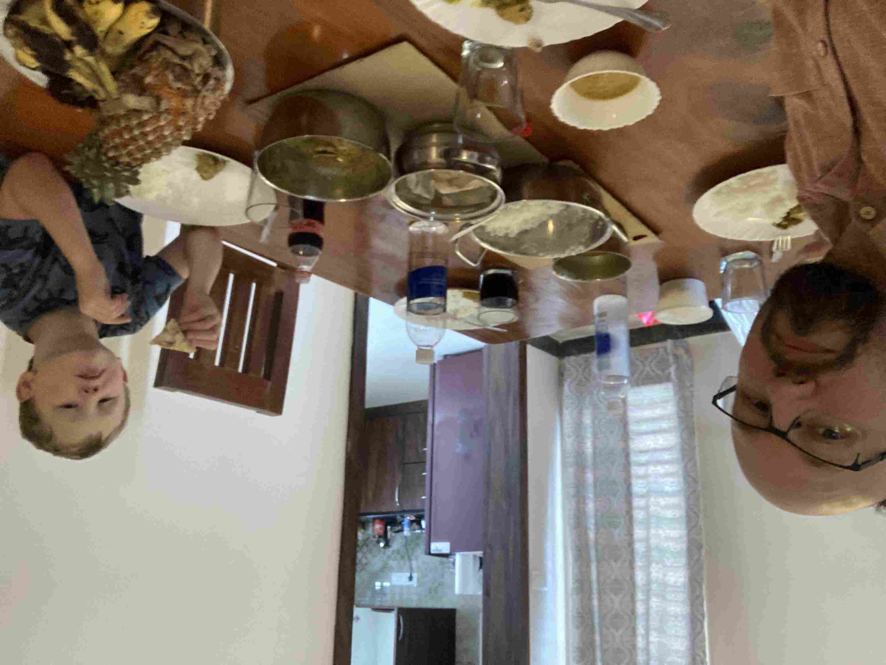
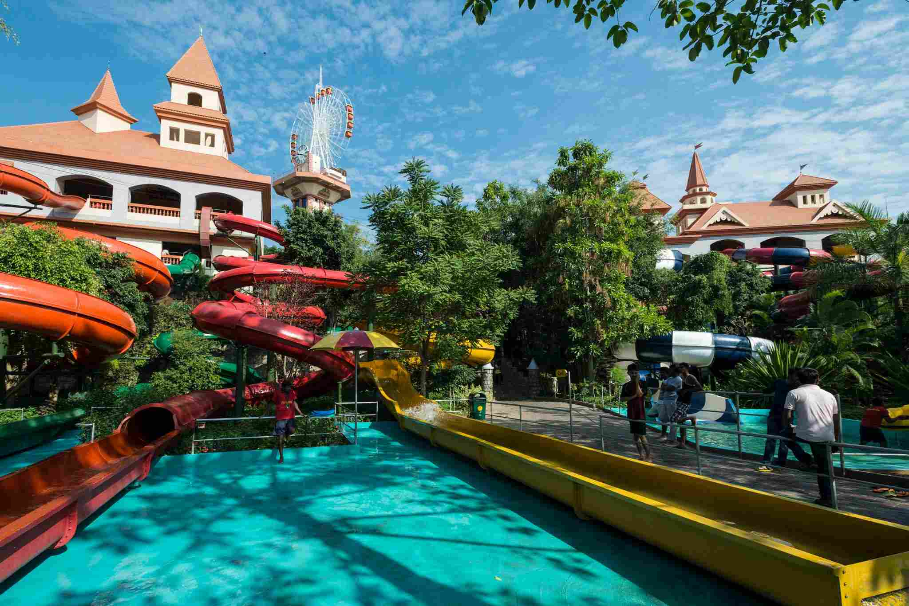
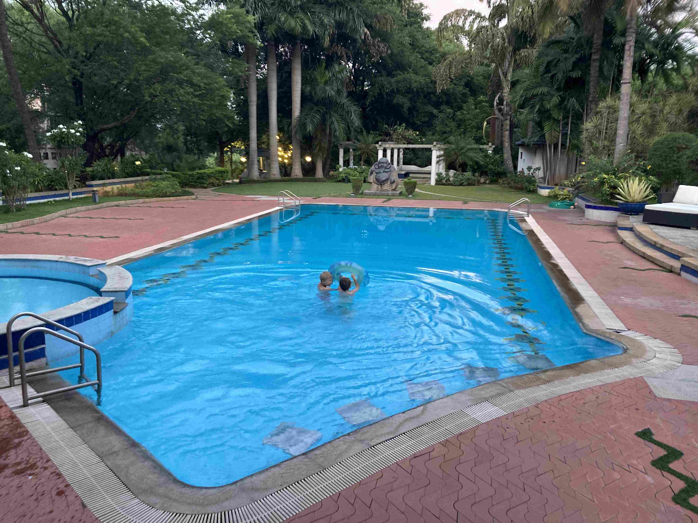
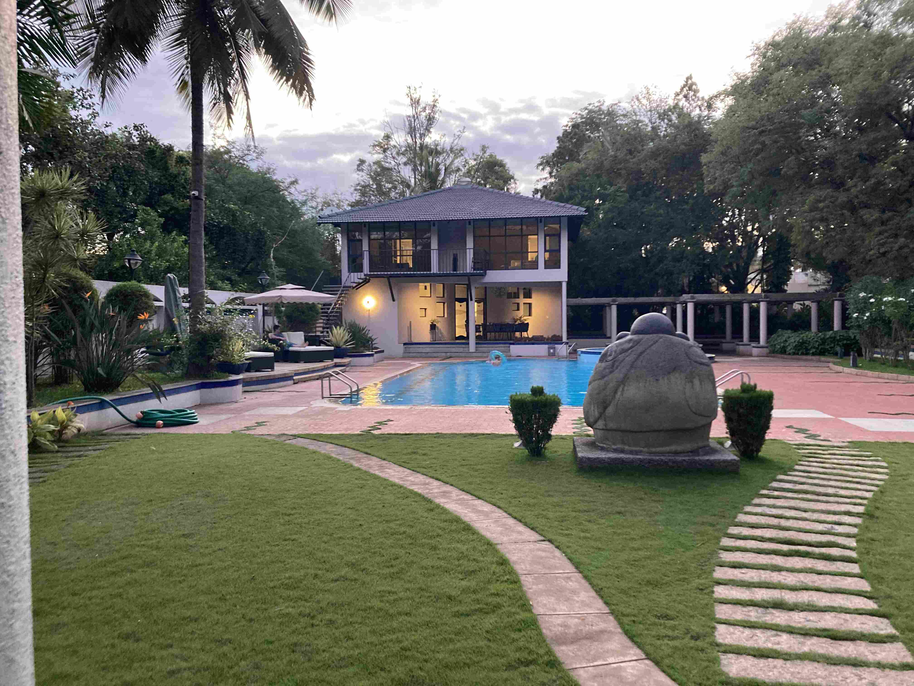
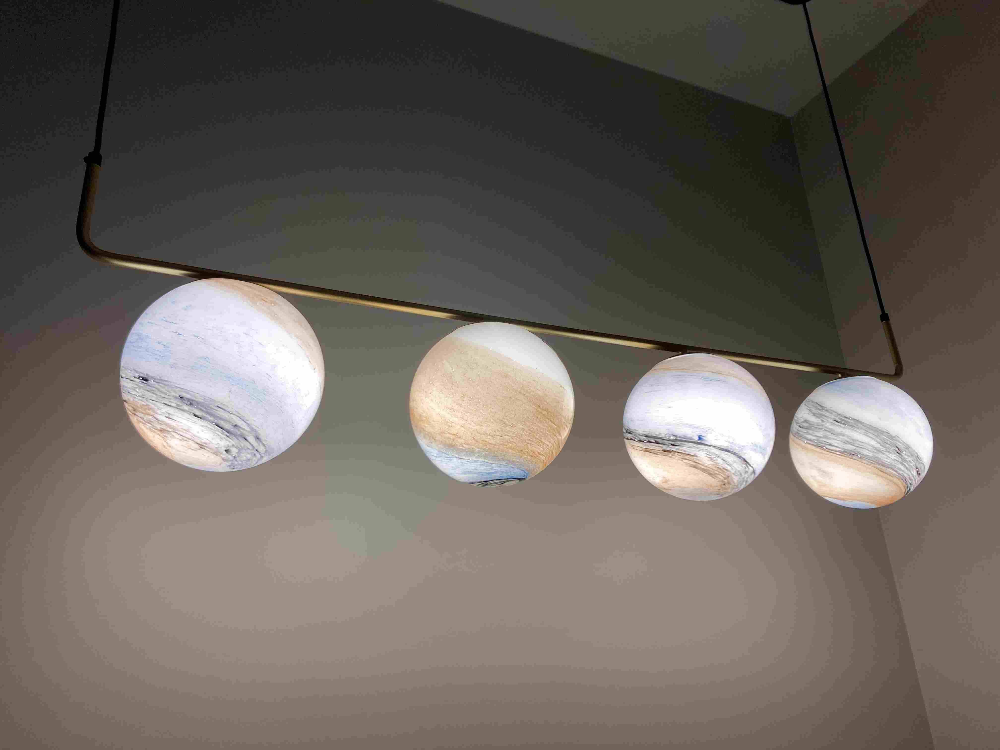
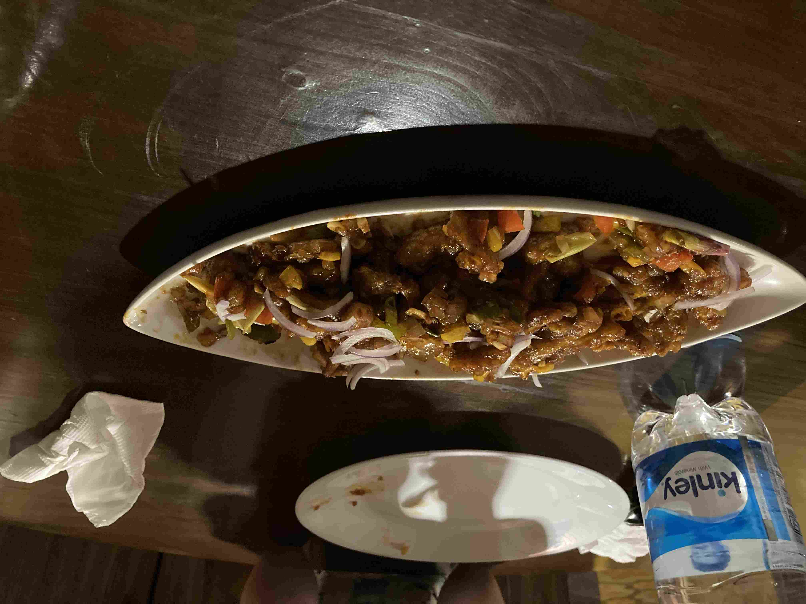
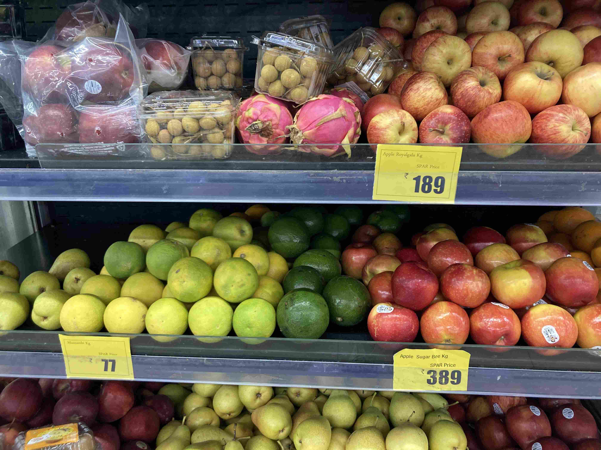

+++
title = 'Nu Har Vi Landat'
date = 2022-07-22T00:00:00+00:00
draft = false
featured_image = "IMG_2796.jpeg"
+++

 Indien är klart och tydligt ett digitaliserat land. Utan en smartphone med mobiluppkoppling är man minst lika handikappad som i Sverige. Konceptet ”Kan du ringa mig en taxi?” besvaras med ”Men beställ en i appen…” och trots den enorma vänlighetskultusen som jag tänkte skriva mer om senare så är det i detta fall helt rätt svar. Det finns i princip bara ett sätt att beställa taxi här, och det är via smartphone. Som tur är kostar ett familjeabonnemang med 3 sim kort och obegränsad data 217kr/mån för alla tre, och då ingår Amazon Prime, någon form av Disney+, och Netflix.
 

 Så häromdagen aktiverades våra sim-kort och nu är vi fria och har landat på riktigt. Några grannar lagar och levererar mat om man beställer minst 5h innan. Så det har vi gjort några gånger.
 

 För att fira våran nyfunna frihet bestämde vi oss för att åka till ett av de största vattenlandet i den här delen av Indien.
 

 Första steget var att vänta på en taxi, och då upptäcktes vi av en flock av fjärilar som var väldigt nyfikna på oss. Min magkänsla sade mig att de här fjärilarna helst äter rutten kött och att det gillade doften av svettig nyanländ Europé. Någon som vet något om dessa?
 

 
 

 Wonderla självt var rejält tilltaget med en massa kreativa rutschkanor och olika lekområden. Ett enorm vågbasäng var helt klart höjdpunkten och lite bra övning tills vi åker ner till kusten senare i år. Dessutom var det kul att se hur många rejält vuxna människor som riktigt hängav sig åt vattenlekarna. Ingen nordisk hipster-reservation här inte.
 

 Photo by Frank Bienewald
 

 Men.
 

 Här har man en helklädd badkultur utan en duschkultur. Förvisso har de benhårda regler på att kläder måste vara ren syntet, men när ingen nakenduschar innan de byter om, och kanske att det fuskas lite med underkläderna. Så tyvärr så var vattnet i det första lekområdet som var både det roligaste och populäraste inte så rent alls.
 

 Och två blonda lintottar var tyvärr för svårt för vissa att hålla fingrarna borta ifrån. Mindre nyp i kinderna, men desto mer att bara ta tag i deras armar för att flytta in dem för ett foto. Jag skall erkänna av att jag njöt lite av att läxa upp mer än en om vad kroppslig integritet betyder, men det blev arbetsamt i längden.
 

 Så sammanfattning: Vågbasängen var ren och kul. Resten var antingen för avancerat eller för otrevligt för att någon av oss skulle kunna slappna av ordentligt.
 

 Men, sedan hände det…..
 

 Det fans inte plats för oss i det stora hotellet vid vattenlandet, så jag bokade något annat som var lite i dyraste laget, men såg fräscht ut och låg tillräckligt nära. Men jag hade inte riktigt förstått vad det var jag bokat. Jag trodde att det var en fristående bungalow på något hotell en bit ut i skogen.
 

 Nej, nej. Inte då. Jag hade bokat ett komplett och eget skryt-sommarstuga med bananodling, halvstor pool, minigolfbana, eldstad, lekpark, sköldpaddsdamm och personlig restaurang. Jag låter Nils förklara:
 

 
 

 Det ni ser ovan var huset och ”tomten” som kanske tog upp 10% av markerna. Det här var som sagt lite i det dyrare laget, men vi satte oss ner och gjorde en budget och vaska de fram pengarna för att kunna åka hit ett dygn i månaden. Så om ni kommer hit och besöker oss så är det hit vi tar er. Huset har nämligen två rum och det kan bo 4 personer i varje rum.
 

 Ja, personlig restaurang ja. Det var bara just nu när den är stängd för renovering. Normalt så är den öppen för allmänheten. Och oj, vad den kocken kan laga mat. Nu förstår jag vad Indiska mat skall vara. Här är en av mina indiska favoriter ”Baby Corn Manchurian” som typ är friterad minimajs i sweet chilli, glufsades ner i ett naffs av alla fyra. Omdömet när alla rätter ätits upp: Minst lika bra som favoritpizzerian hemma.
 

 Efter maten så var det bara att slänga sig i poolen igen. Inget säger tropikerna för mig så mycket som varma nattbad.
 

 
 

 Nu är vi hemma igen, och sitter faktiskt i lägenheten under våran. Utan att tråka ut er med hela historien så fick vi ett annat, större, rum än det vi bokat för de höll på att avsluta renoveringen av vårt rum. Men det större rummet hade inte luftkonditionering som utlovat. Ägaren gav oss då valet att behålla det större rummet om vi ville till samma kostnad, och låta installera både luftkonditionering och kombinerad tvättmaskin/torktummlare för en mindre investering från vår sida. Så handpenning är lagd och nu håller de på att avsluta installationen av luftkonditioneringen.
 

 Vi har också varit och handlat, och då kan man titta lite på fruktpriserna. Citrusfrukt: 10kr/kg, Äpplen: 24kr/kg och uppåt.
 

## Och en avslutande reflektion

 Varför åkte vi hit? Eller, varför drev jag på att vi skulle åka hit? Det finns flera anledningar.
 

 Den första och enklaste: Jag är personalansvarig för ett dussintal personer i denna stad och har inget egentligt ansvar för något annat i mitt företag. Trots att jag kan leda på distans, så är det verkligen jättemycket lättare om man regelbundet träffas fysiskt. Gärna flera gånger i veckan. Och så ser det bra ut på mitt CV att riktigt cemtentera min tvärkulturella kompetens.
 

 Den andra handlar om barnen. De kommer få lära sig hur det är att interagera med en annan kultur med allt vad det innebär av språk och beteenden. Och eftersom den Indiska kulturen och det Engelska språket är vad det blev, så kommer de förstås lära sig dessa på djupet. De kommer också få lära sig om klassklyftor på ett sätt som är svårt att synliggöra i Sverige. De kommer lära känna snickarlärlingarna som jobbar långa dagar i snickeriet tvärs över gatan och mannen som skruvar isär skrivmaskiner och eldar bort kabelisolering över öppen eld för att sälja skroten som ren metall.
 

 Men, de kommer också få uppleva en guilty pleasure som jag själv har burit med mig sedan jag var liten, men gärna håller för mig själv. De kommer få uppleva hur det är att tillhöra den riktiga överklassen. Hur är det att gå och veta att man har råd med precis allt man ser. Att bo i hus med betjänter i plural. Att vara välkommen och uppskattad precis överallt. I stora portioner tror jag det är otroligt destruktivt. Men i små portioner är det väldigt, väldigt, trevligt. Både för barn och vuxna.
 

