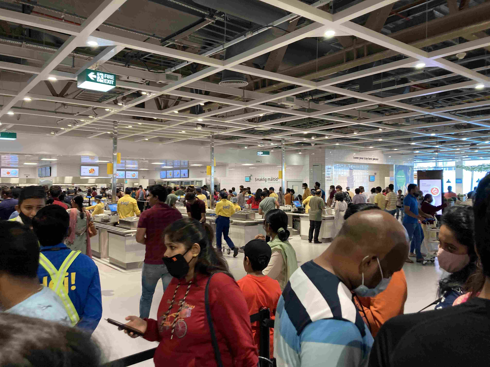
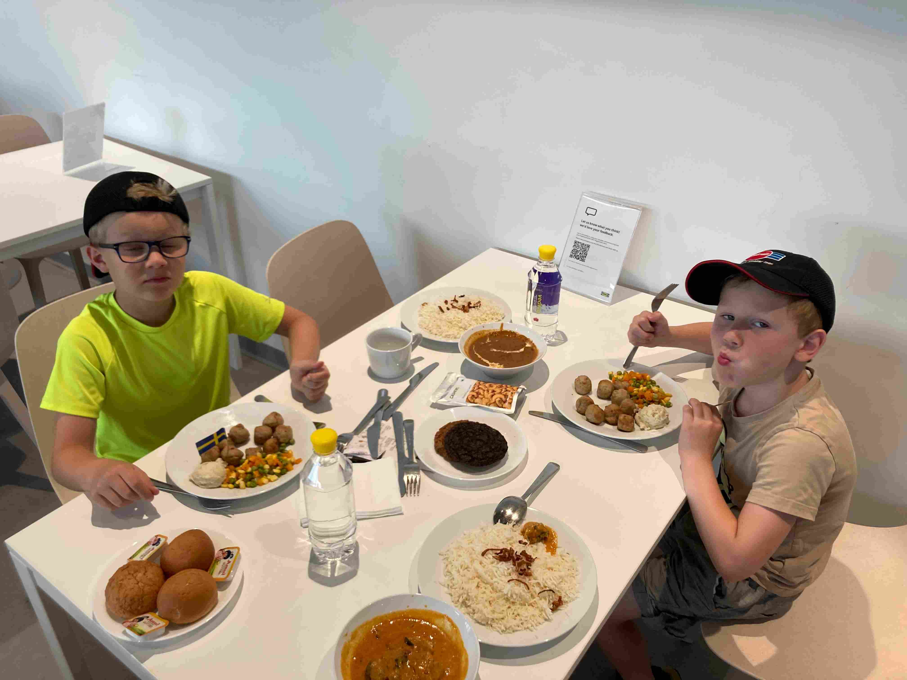
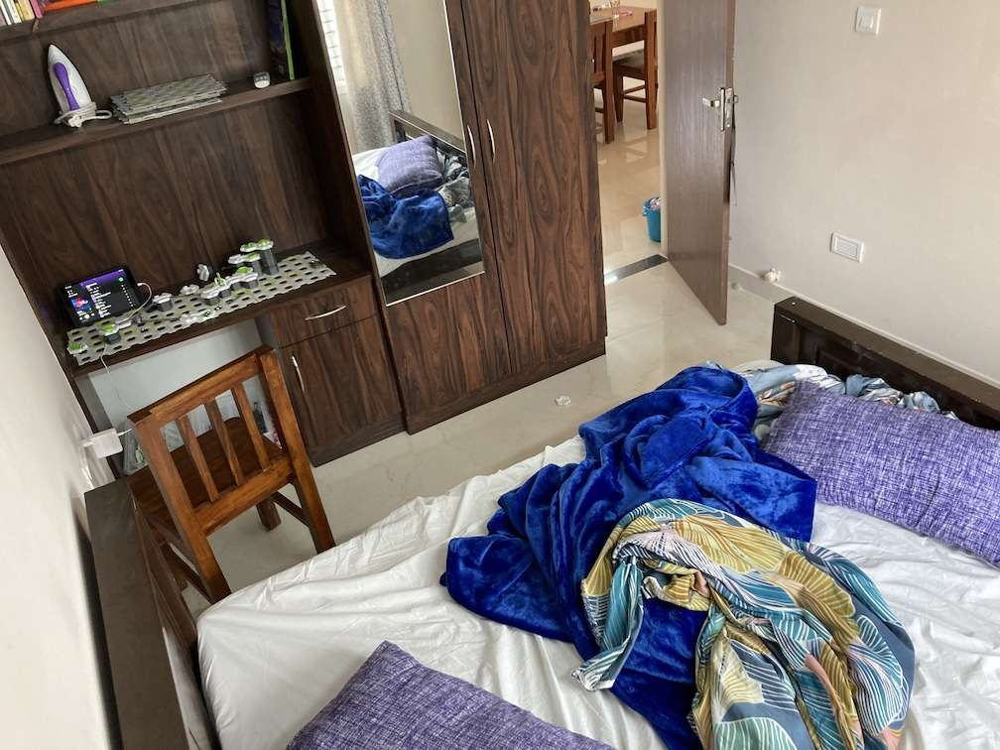
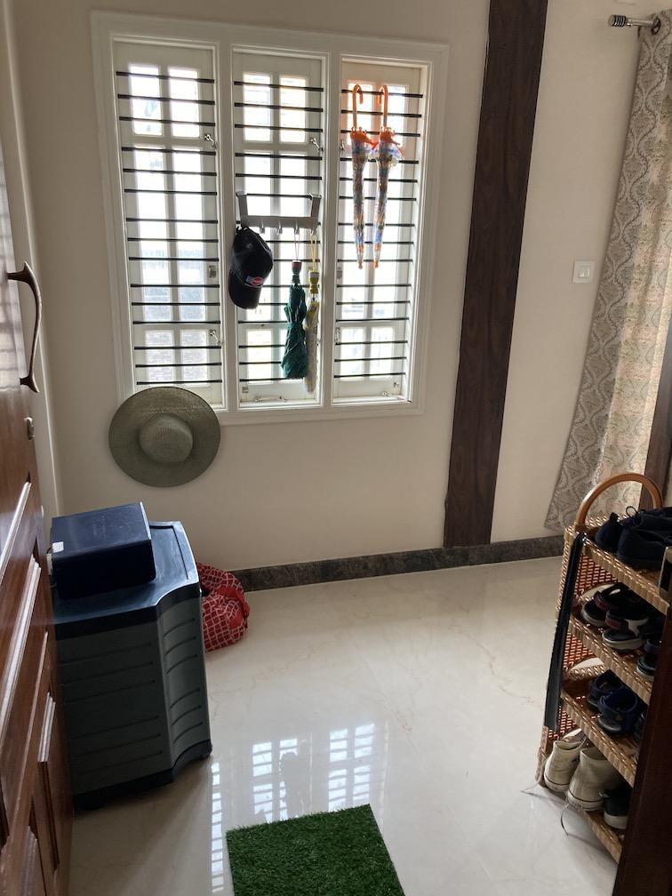
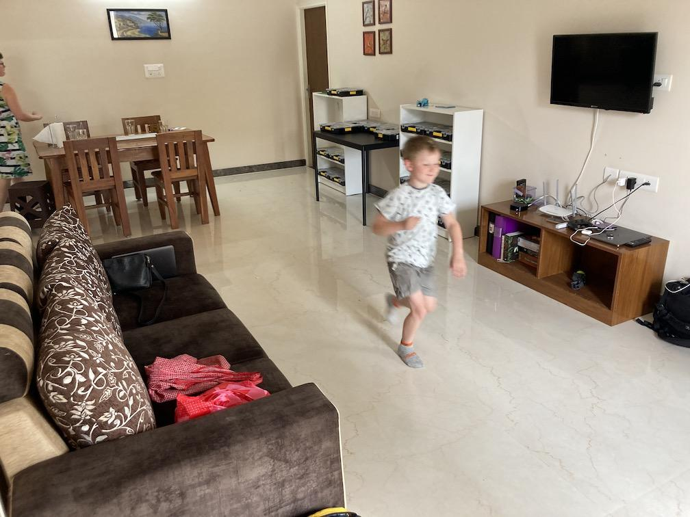
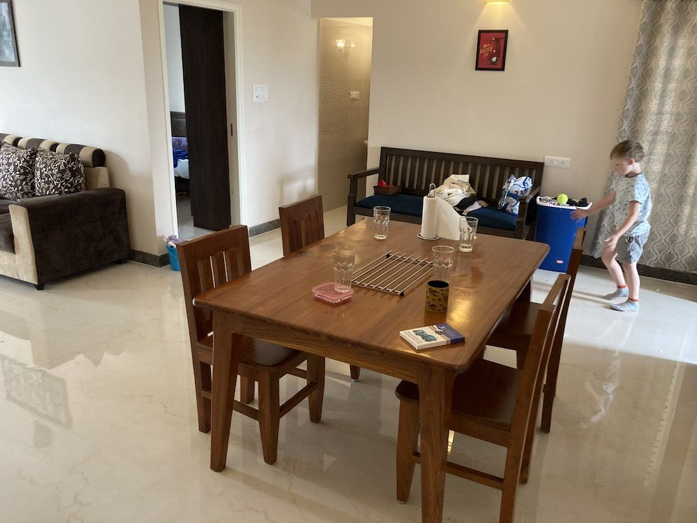
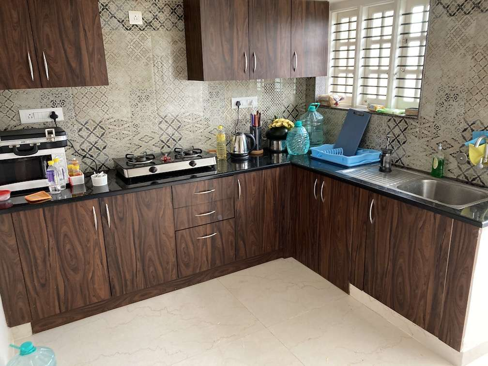
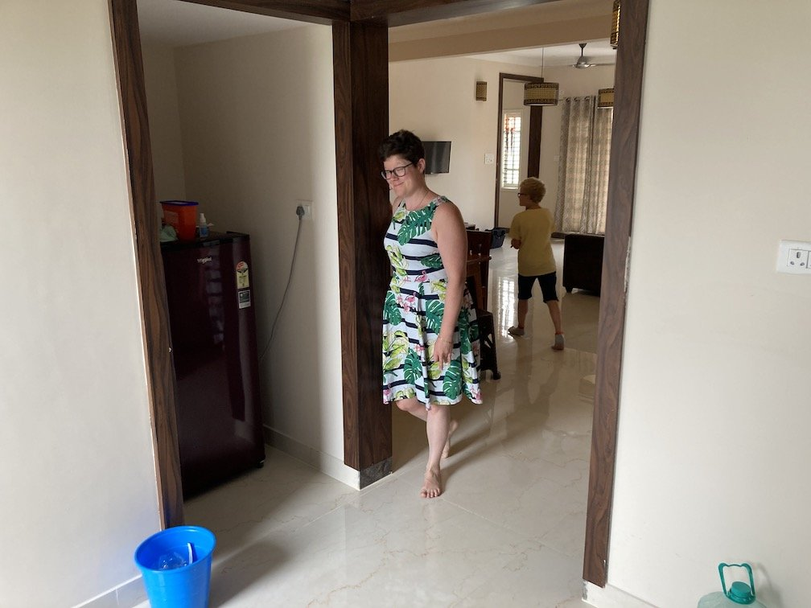
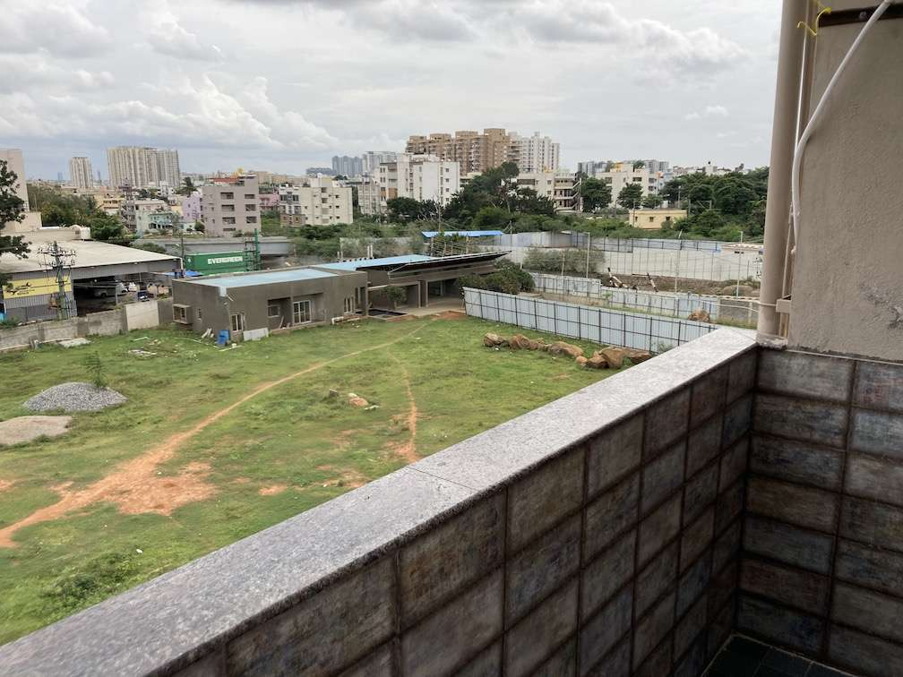
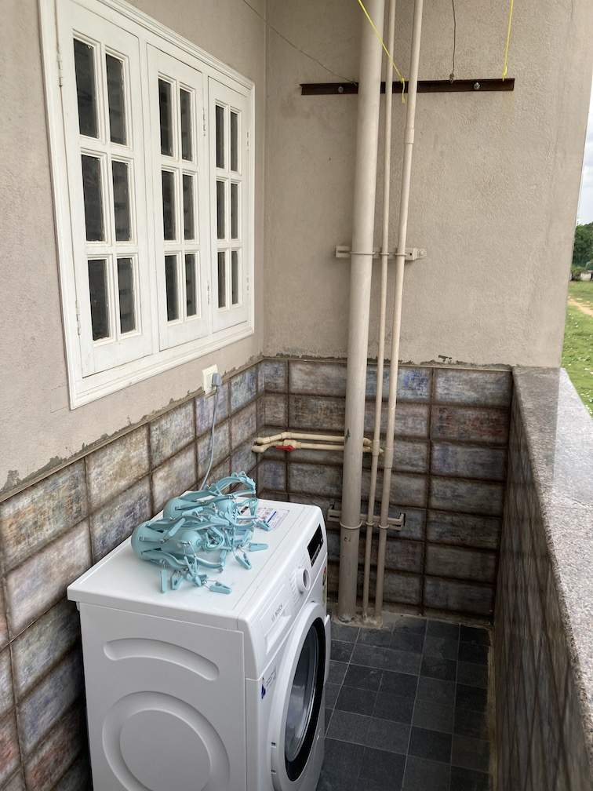

+++
title = 'Sa Antligen Ar Lagenheten Klar'
date = 2022-07-24T00:00:00+00:00
draft = false
featured_image = "IMG_2825.jpeg"
+++

 För bara några veckor sedan så öppnade Ikea i Bangalore, och i går gjorde vi det obligatoriska besöket. Både för att äta maten och för att handla några saker som inte vanliga butiker här verkar ha, typ knivställ.
 

 Jag har hört att köerna ringlade sig långa på öppningsdagen, och det är tydligt att Svensk design lockar, för det var knökfullt.
 

 Till slut så fick vi i alla fall vår mat, och den smakade som väntat, dvs ganska genomsnittligt, men bra med tanke på priset. Faktiskt kanske till och med lite bättre än i Sverige. Jag reagerade på det här på Burger King för några dagar sedan. Eftersom de slänger i mycket mer kryddor i all mat här, även hos de internationella kedjorna, så smakar även skräpmat faktiskt lite bättre.
 

 Men åter till lägenheten. Idag kom sakerna vi beställde och nu har också lägenheten hittat någon form av harmoni utan synliga flyttkartonger. Och lakan i ren bomull. 😀
 

 Så, äntligen får ni se hur vi bor. Ett Svenskt hem i en Indisk lägenhet.
 

