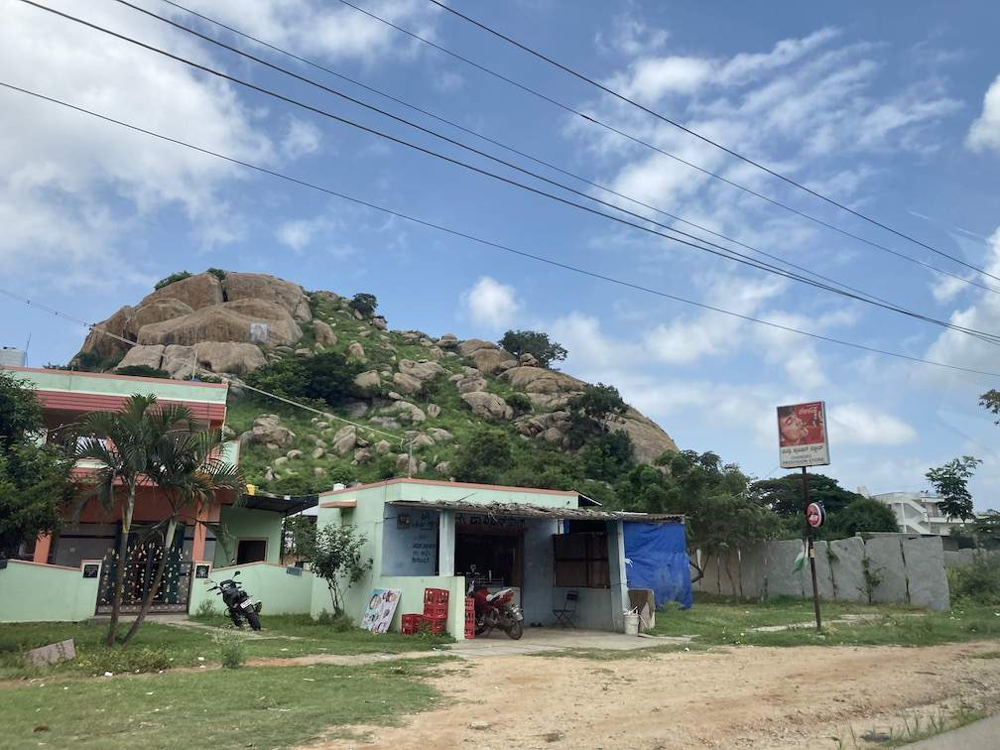
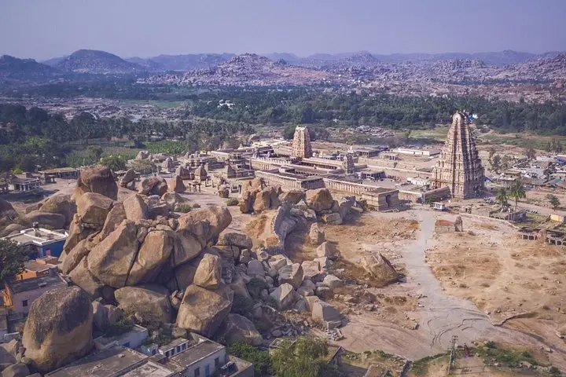
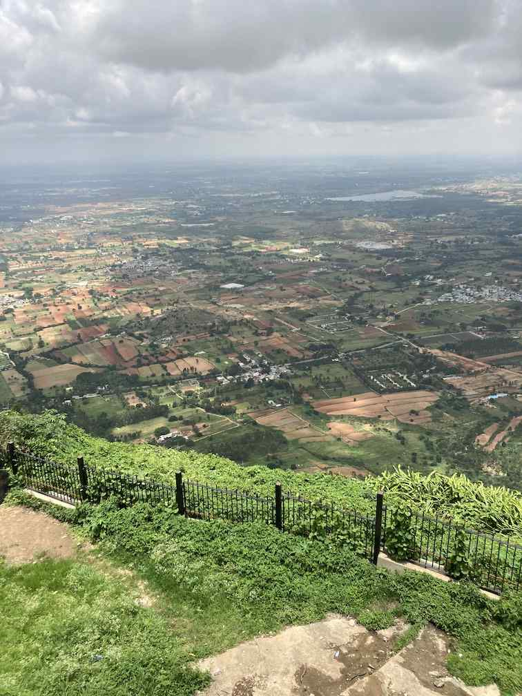
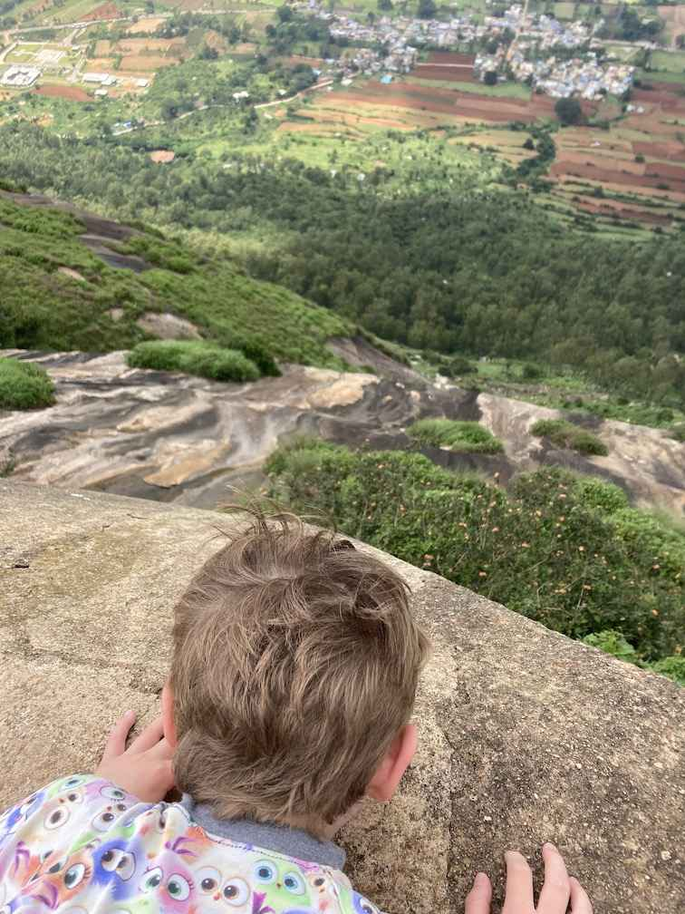
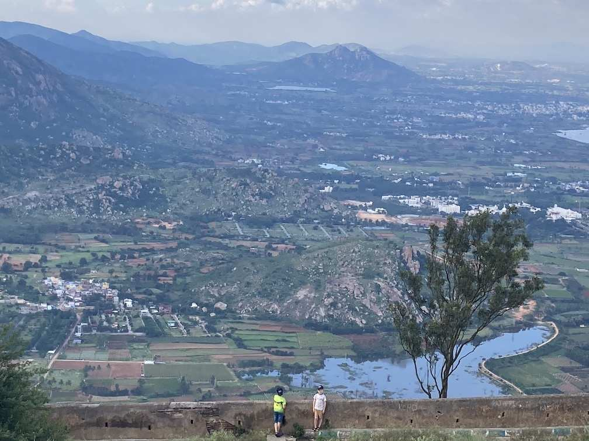
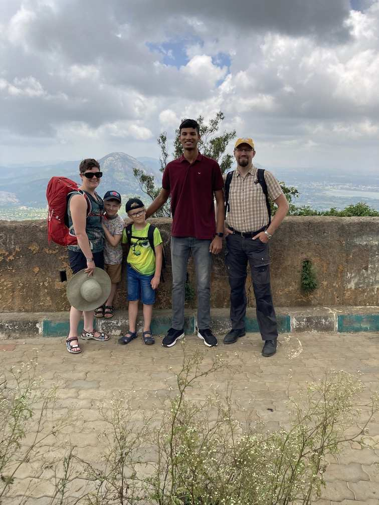
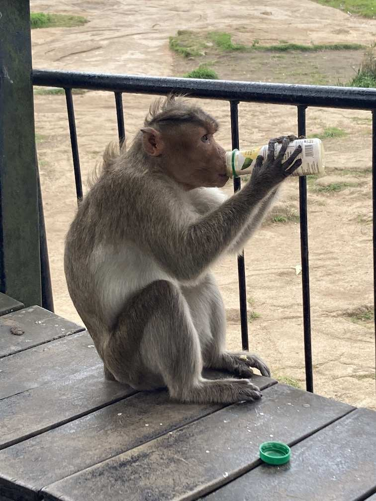
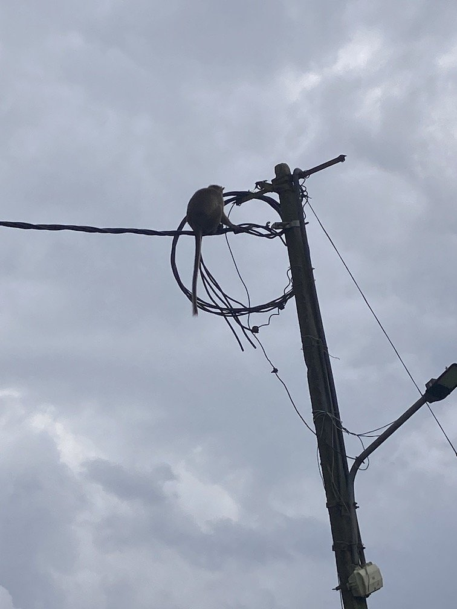
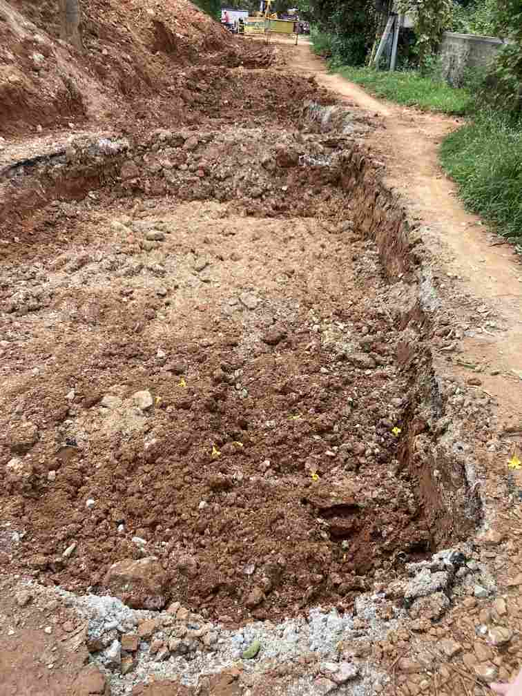

+++
title = 'Skolstart'
date = 2022-08-03T00:00:00+00:00
draft = false
+++

 Då var årets sommarsemester slut, och skolan börjar.
 

 Sedan sist har vi varit ute på en del äventyr, men lika mycket gosat in oss i vår nya vardagsmiljö.
 

 Vi börjar med vardagsmaten. Vi bor i det huvudsakligen vegetariska södra Indien, och den ”vanliga” matbutiken närmast oss säljer inget kött alls. Men runt hörnet ligger ett slakteri som säljer kyckling och lamm/get. Stackarn på skärbrädan nedan levde bara en kvart innan bilden togs, och är fortfarande varm. Till och med jag som styckat hundratals fåglar hajade till lite på den känslan. Men jag kan säga att den inte dog förgäves. Den har säkert bott i en bur lite mer än vad den skulle gillat, men den har verkligen fått växa till sig i naturlig takt och hade helt annan smak och konsistens än till och med de Svenska Bosarpskyklingarna som jag annars älskar.
 

 En annan vardagsrutin som jag tagit mig an med viss tveksamhet är ett Amazon i toppform. Detta paket beställde jag någon gång efter 14, så fyra timmars leverans. En morgon klockan 8 fick jag veta att jag kunde få mina saker innan 11….
 

 Vårt största äventyr var ett besök till Nandi Hills, ett måste enligt alla guideböcker. Nandi Hills är en kombination av vanligt turistmål och pilrimsresamål, något som verkar ganska vanligt här. Rent konkret är det en jätteklippa som höjer sig över omgivningen med ett halvgammalt fort på toppen, kombinerat med ett aktivt tempel.
 

 På resan dit så fick vi en första känsla för geologin. Som jag förstått det har södra Indien bland den äldsta markytan i världen och det vi ser här är gammal granit som bara slipats av regn och vatten under jättelång tid. Inga istider, inga vulkaner, inga nya berg som kommit upp till ytan.
 

 På andra platser i Indien blir det ännu mer extremt som på den här bilden från Hampi några tiotals mil norr om där vi var.
 

 Väl på toppen så var det fikadags. I en värld där allt är annorlunda så lev ett mariekex, bakat med exakt samma recept som i Göteborg en liten stund av lugn. Livets små saker…
 

 I vanlig ordning var det mer än en grupp som ville ta foton med oss. Det spännande är att det aldrig händer i det ”vanliga” Bangalore. Bara när vi är på turistorter eller andra speciella platser. Nedan en basketspelare som var där med sitt lag.
 

 Men den största upplevelsen var aporna. De lekte i elledningarna och var hyggligt aggressiva när de såg vår klase bananer. Efter lunch så vaktade vi inte en stängd smoothieflaska så noga, och den stals, öppnades och dracks snabbt upp, med förvånadsvärt bra teknik till livliga hurrarop från oss allihopa.
 

 När vi kommit hem, så var det dags att ladda inför skolstarten, och det görs bäst med Minecraft.
 

 Och så inläggets obligatoriska kossa. Denna gång en flock som vallas förbi gatan där vi bor.
 

 
 

## Reflektion

 Som jag skrev i ett tidigare inlägg så har jag tänkt mycket på infrastruktur här i Indien. Vad finns under det som syns på ytan, både rent konkret, men också i samhället. Och hur skiljer det sig från Sverige. Så, dags för lite funderande och spekulation. Vi får se hur väl det här inlägget åldras.
 

 Men vi kan börja konkret. Den här bilden visar ganska tydligt en skillnad mellan Indien och Sverige. Det är en liten väg mellan några bostadshus som grävts upp för att lägga ner någon form av rör eller ledning.
 

 Det vi ser är den lerjord som Bangalore till största delen byggs på, och sedan ett gruslager som är några få centimeter tjockt, och så till slut ett lager asfalt.
 

 Mitt minne säger mig att det inte är så här vi bygger väg i Sverige. En snabbkoll (Rätta mig om jag missförstått) visade att en Svenska väg har över 40cm av olika gruslager under sig för att sköta dränering och se till att inget rör sig. Nu har vi förvisso tjäle i vår mark, men här har de monsunregn och inget system med dagvattenbrunnar. Och det här är ett genomgående tema jag ser, tyvärr. Det saknas en solid grund i så många saker.
 

 Jag har fått veta att Bangalore till stor del inte är ordentligt detaljplanerat, utan mest vuxit. Vägnätet, sophämtningen, vattnet och elen är alla gravt underdimensionerade. Samhällskontraktet är svagt och man bryr sig inte om det som ligger utanför den egna tomtmarken. Villor som kostat flera miljoner svenska kronor att bygga ligger vägg i vägg med en soptip, diket utanför är igenslammat och trotoarens stenar ligger snett och vint. Alla dessa problem skulle bara kosta växelpengar för de boende att låta fixa, men det gör man inte. Jag tror det var vår hyresvärd som sade ”Varför bry sig? Det blir bara nersmutsat igen i morgon.” och ”Ingen politiker i Indien försökte någonsin göra något annat än berika sig själv. Men i år är det valår, så då kommer vägen utanför att asfalteras.”
 

 Jag drar paralleller till ett annat problem jag ser här. Indien är ju ökänt för en kultur där man säger ja, och gör precis och exakt det man bir ombedd, vare sig det är logiskt eller inte. Alla hus ser väldigt fina ut när de är nya, men de flagar och spricker snabbt.
 

 På de flesta större offentliga toaletter jag varit på så finns det en person som i princip jobbar heltid med att städa bara denna toalett. Denna person kommer pliktskyldigt moppa golvet regelbundet, men vad hjälper det när avloppen, väggarna och alla hörn är ingengrodda med illaluktande smuts? Och när allt är slitet och luktar illa, varför skall man då bry sig?
 

 Men allt är inte mörker och lera. På vägen till där jag nu sitter och skriver så gick vi genom ett bostadsområde med vad som tydligt var villor för den övre medelklassen. Där såg vi ett antal hus som tydligt på egen hand fixat sin trotoarbit. Och ett dussin gatustädare gick och sopade gatan för att hålla den någorlunda ren. Tvärs över stora gatan vi bor är ett liknande område där det också är tydligt att det gemensamma tas om hand om, i alla fall lite gran.
 

 Så min sammanfattning är att ja, mycket i Indien är billigt, men tyvärr så ser man tydligt var besparingar gjorts, och det är inte bara i låga löner.
 

 Men så har vi ett undantag. Mobiltelefoni och mobilt bredband. Här har vi en tjänst som är genomgående minst lika bra som i Sverige, och kostar en bråkdel. Hur kan det funka? Min gissning är att just mobiltelefoni just inte kräver så mycket till infrastruktur. Det måste finnas hus som är stadiga nog att bygga mobilmaster på, vilket finns, och ström som inte stängs av längre än att ett reservaggregat kan fylla i luckan.
 

 Så nu är det verkligen tydligt för mig varför Europa i stort ligger efter med digitala betalningar och liknande tjänster. Mobil teknologi är verkligen en teknik som går att bygga utan att så mycket annat byggts innan. Och när andra system funkar dåligt så blir värdet av att anamma just denna teknologi väldigt stort för varje individ.
 

