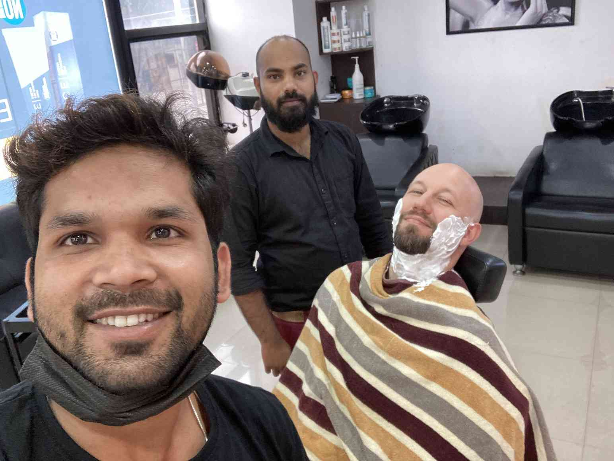
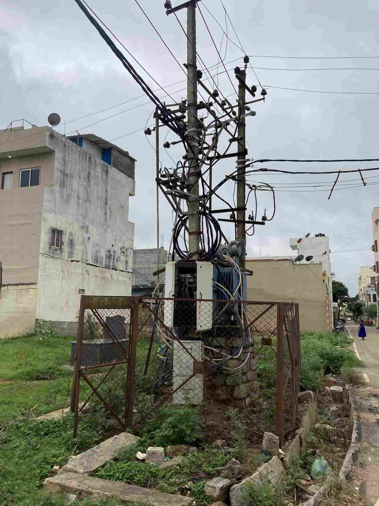
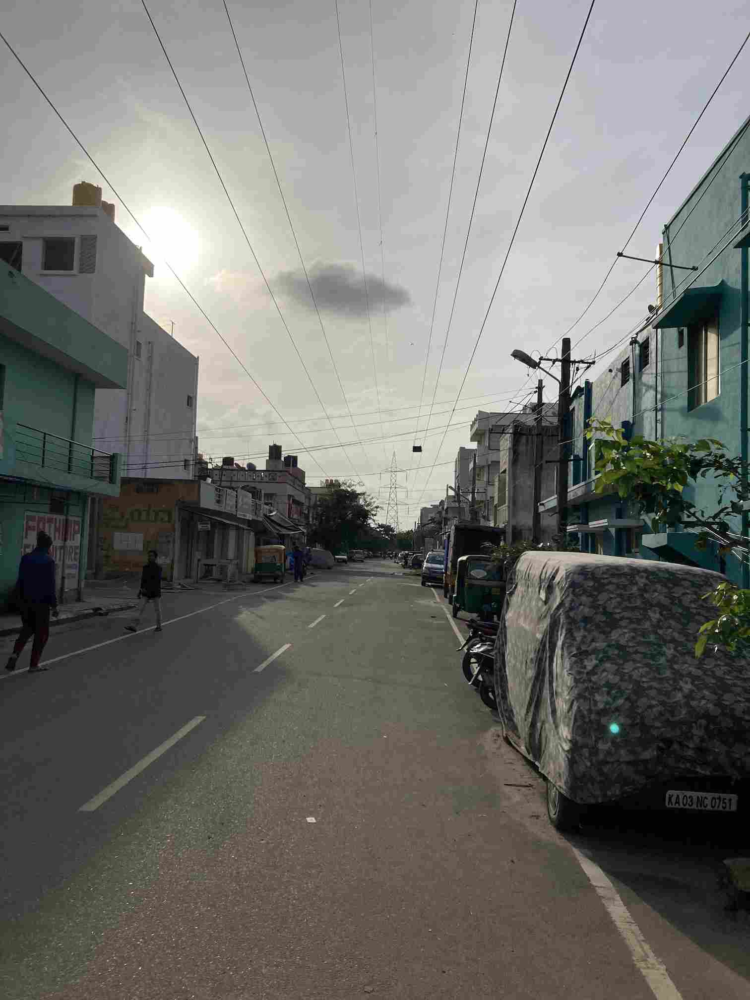
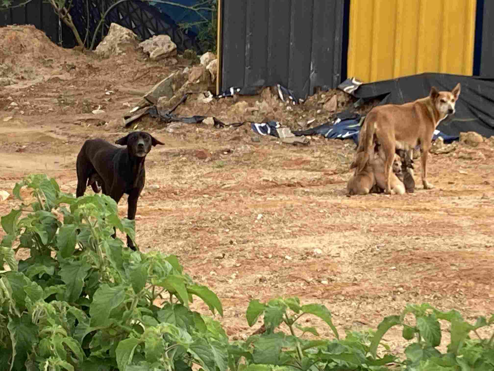
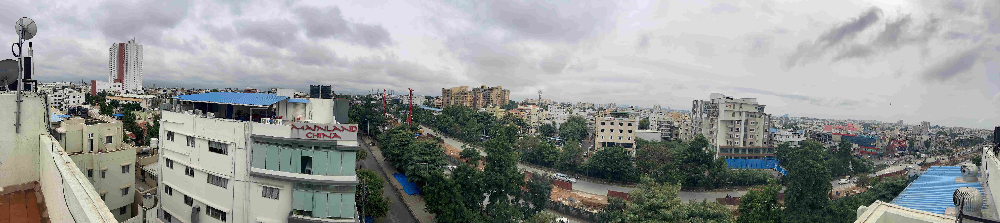
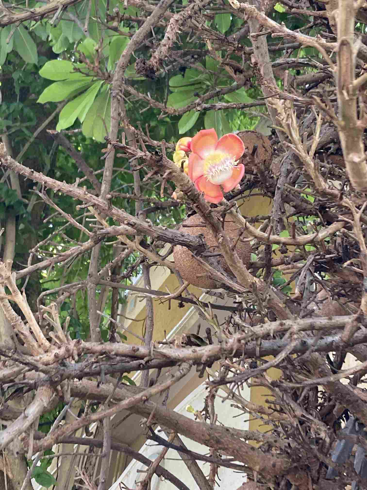
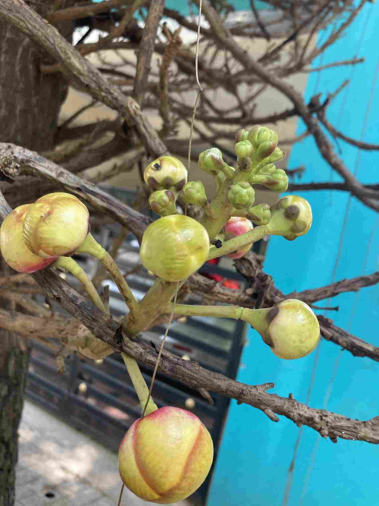
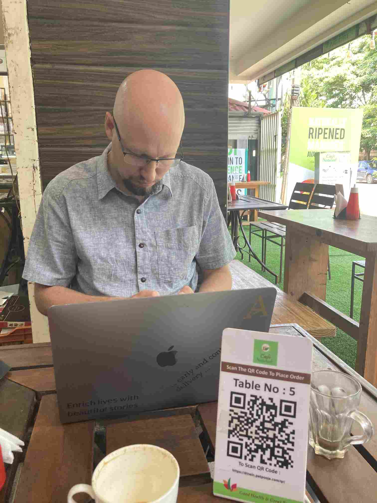
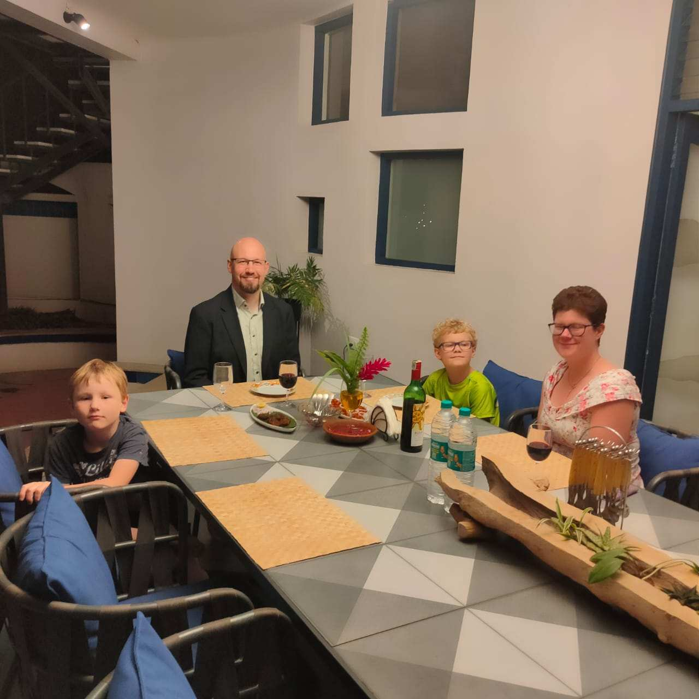
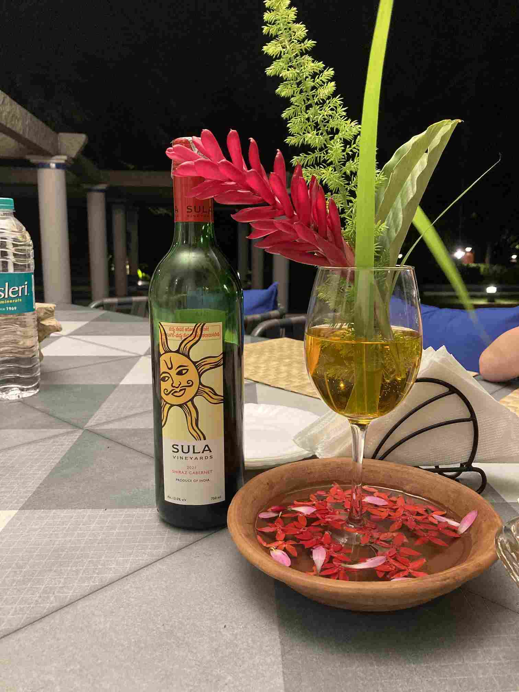

+++
title = 'Forsta Skolveckan Avklarad'
date = 2022-08-10T00:00:00+00:00
draft = false
+++

 Vardagslivet fortsätter….
 

 En Kadai-panna och god Paneer-ost är grejen. Svenskarna borde hänga på.
 

 Frisören i bakgrunden och hans lärling.
 

 Elstolpe. Minimalistisk, men endå med extra allt.
 

 Kraftledningsgata
 

 Frukost för hundvalpar. Igår var det den svarta som diade, så jag funderar på om detta är två honor som tagit gemensam vårdnad över kullen.
 

 I indien gillar man peppiga meningar. . Speciellt på gymmen.
 

 Utsikten från kontoret
 

 Första skoldagen så promenerade Rebecka och jag från skolan bort till ett café och då såg vi detta bisarra träd. Det ni ser är alltså utväxter på huvudstammen som mest ser ut som en parasit. Resten av trädet ser ut som ett vanligt träd. Inte ens en lokalbo visste vad det hette annat än att blommorna är en viktig del i en Shiva-ritual. Jag förstår fullkomligt.
 

 Och så kunde vi inte hålla oss från att åka en gång till till The Ananta för att fira / repa oss från första skol- och jobbveckan.
 

 Fotograf: Nils
 

 
 

 Videosamtal med Sverige. Inga mer postband med flera veckors leveranstid.
 

 
 

 
 

## Reflektion

 Idag vill jag skriva om det jag kallar för den Indiska Vänlighetskulturen. Den är tätt sammanvävd med den lite mer berömda Ja-kulturen, dvs att en Indier aldrig säger nej, på gott och ont.
 

 Det jag lärt mig är att Indisk kultur lägger stor vikt vid harmoni. Och harmoni står i motsats till konflikt. Alltså undviker man konflikt. Som Svensk så känns det här ganska bekant eftersom vår konsensuskultur också gör att en Svensk gärna inte sätter ner foten och säger nej bara så där.
 

 Och jag måste säga att jag verkligen gillar denna harmoniska vänlighetskultur, för det gör att livet i Indien är otroligt trivsamt. Byråkratin här må inte vara så digitaliserat blixtsnabb som i Sverige, men alla myndighets- och byråkratipersoner jag pratat med visar mig hela tiden till nästa steg, och inom en rimlig tid så är ärendet avklarat. Det finns en god chans att jag har ett indiskt ”personnummer” redan i mitten av nästa vecka.
 

 Hyresvärden är en jättetrevlig person som är lösningsorienterad och mån om att vi skall trivas.
 

 På kontoret jag arbetar så är det ett lugn och ett fokus med vänliga röster och alla försöker hjälpa varandra. Just atmosfären på kontoret var en inte helt oviktig del i varför jag ville arbeta här.
 

 Och så avslutar vi med trafiken. Man kan inte prata Bangalore utan at prata trafik. Den är ökänd för att den är seg och strulig och alla tutar hela tiden. Men jag tycker inte att det är så illa. Vår Essingeled i Stockholm är inte superkul i rusningstrafik alla dagar. Och efter uppemot 50 taxiresor så har jag fortfarande inte sett någon förare som uttryckt otrevlig ilska eller någon större frustration. Biltutorna här har ett mjukare ljud än i Europa, och det går tydligt att höra skillnad på någon som tutar för att få uppmärksamhet och någon som är ilsk, och det är mycket få ilske-tut.
 

 På det hela taget så är trafiken här väldigt mycket så som cykeltrafiken är en vardagsmorgon vid Hornstull. Ja, det är lite trångt. Ja, det kräver lite uppmärksamhet. Ja, ibland så strular det till sig lite och någon ropar till lite högre. Men är man bara i känslomässig balans själv så är det inget att jaga upp sig över.
 

 Och den tanken känner jag genomsyrar hela min upplevelse av Indien hittills.
 

