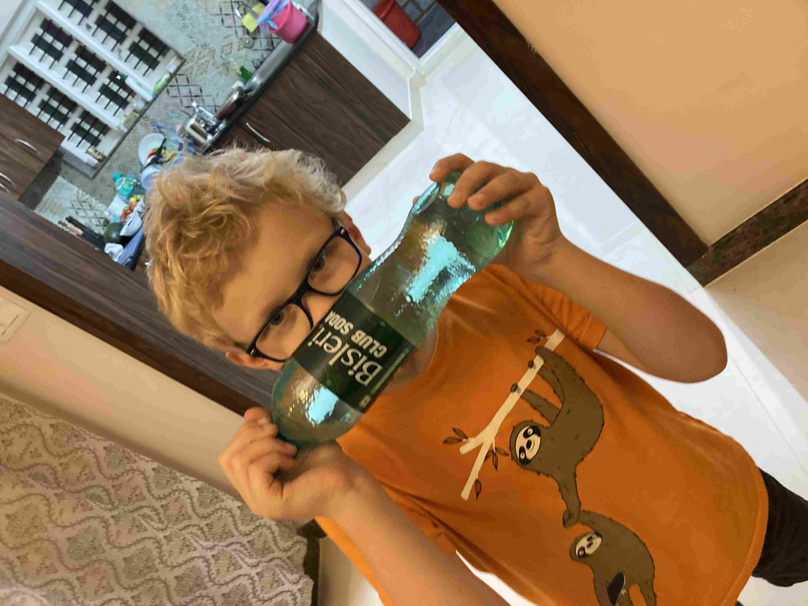

+++
title = 'Alla Sanningar Ar Redigerade'
date = 2022-08-15T00:00:00+00:00
draft = false
featured_image = "IMG_2982.jpeg"
+++


 Så även denna dagbok. Men här kommer en lite mer djuplodande intervju med Nils om hans upplevelse av resan hittills.
 


```
D: *Om du tänker tillbaks från när vi satt på Arlanda och precis skulle flyga iväg, hur kändes det då?*
N: **Lite pirrigt, jag minns inte att jag har åkt flyg förut.**

D: *Just ja, du var ju 2.5 år gammal sist vi flög.*

N: **Mm, så jag minns inte flyget, men jag minns efter och innan.**

D: *Vi flög först till Frankfurt, och sedan så flög vi hela långa vägen till Bangalore. Hur kändes det?*
**N: Mer nervöst än på första flyget.**

D: *Och varför tror du det?*

**N: För att jag skall till ett helt nytt land som jag aldrig har varit i och gå i skolan där.**

*D: Och hur var maten på flyget?*

**N: Njea, den var inte så god.**

*D: Nej, det var ju inte bra mat för dig, eller hur?*

**N: Nej**

*D: Sedan kom vi hit. Hur var det första veckorna här innan skolan började?*

**N: Najs**

*D: Vad tyckte du om maten? Kommer du ihåg vad du tyckte om maten precis när du kom hit? Om chilli, till exempel?*

**N: Inte så gott. För några månader innan så hade jag ätit megastark korv på Korvfestivalen.**

*D: Men vad tycker du om chilli nu?*

**N: Gott.**

*D: Och hur var det i skolan, om vi börjar med allra första dagen?*

**N: Pirrig. Och nervös.**

*D: När du kom hem, var du glad eller ledsen då?*

**N: Glad.**

*D: Men sedan, dag två, hur kändes det då?*

**N: Mer nervöst.**

*D: Ja, precis. Det var lite jobbigt, eller hur?*

**N: Ja.**

*D: Sade du något om att du var nervös för att det kanske skulle serveras äcklig mat?*

**N: Ja.**

*D: Men nu har du gått i två veckor. Har det serverats någon äcklig mat?*

**N: Jag har… tåligt maten… och på fikat har det varit Mariekex** och ketchup, det var jättegott! Det är faktiskt gott.

*D: Mariekex med ketchup?*

**N: Ja, det är jättegott!**

*D: Och hur är det med frukosten? Du sade något om ifall de skulle servera äcklig frukost. Men vad finns det på frukosten?*
**N: Choklad- och vaniljflingor eller jordgubbsflingor. Plus vattenmelon.**
*D: Och lunchen då?*

**N: Det brukar finnas vitt ris, och någon paneer**, men det brukar inte finnas längre.

*D: Nehe, var har du ätit då?*

**N: Någon annan gryta.**

*D: Så om du vill hälsa något till dina kompisar, eller till till Nils när Nils är vuxen, hur är det att komma till ett helt nytt land så här?*
**N: Jättenervöst…. Och pirrigt.**

*D: Så var det då jättenervöst i två veckor?*

**N: Ja, jag tyckte det, men det kan ta bara en vecka.**

*D: Är det fortfarande jättenervöst?*

**N: Nej.**

*D: Underbart! Tack så mycket, Nils.*
```

## I övrigt


 Nils har äntligen hittat ett föremål i Indien som inte luktar något alls.
 





 Inför Indiens 75-årsdag så spelar blandade orkestrar på gatorna.
 


