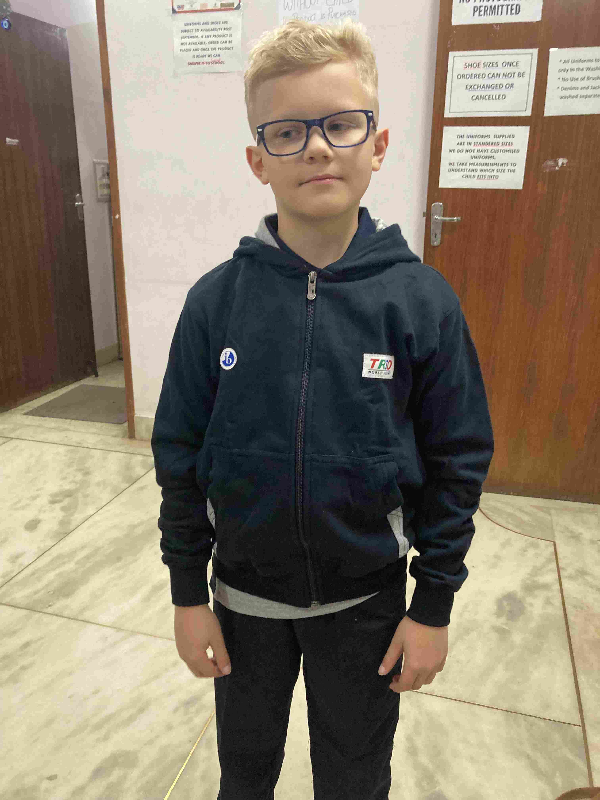
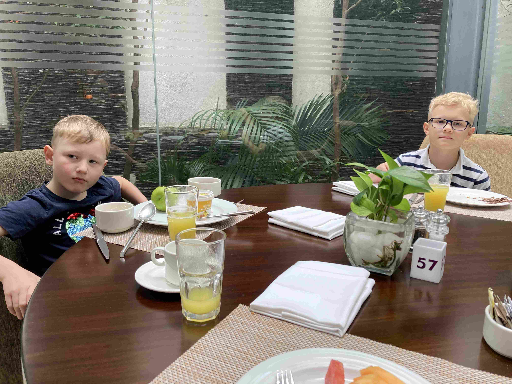
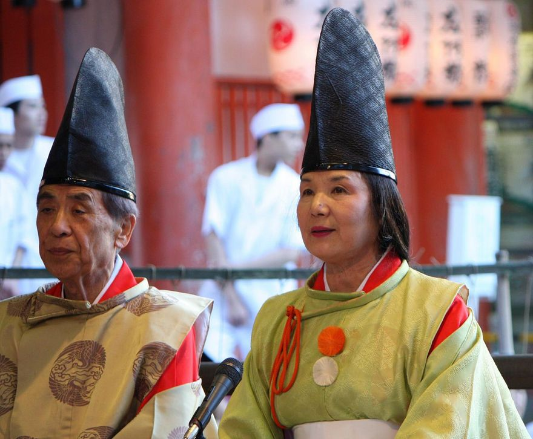
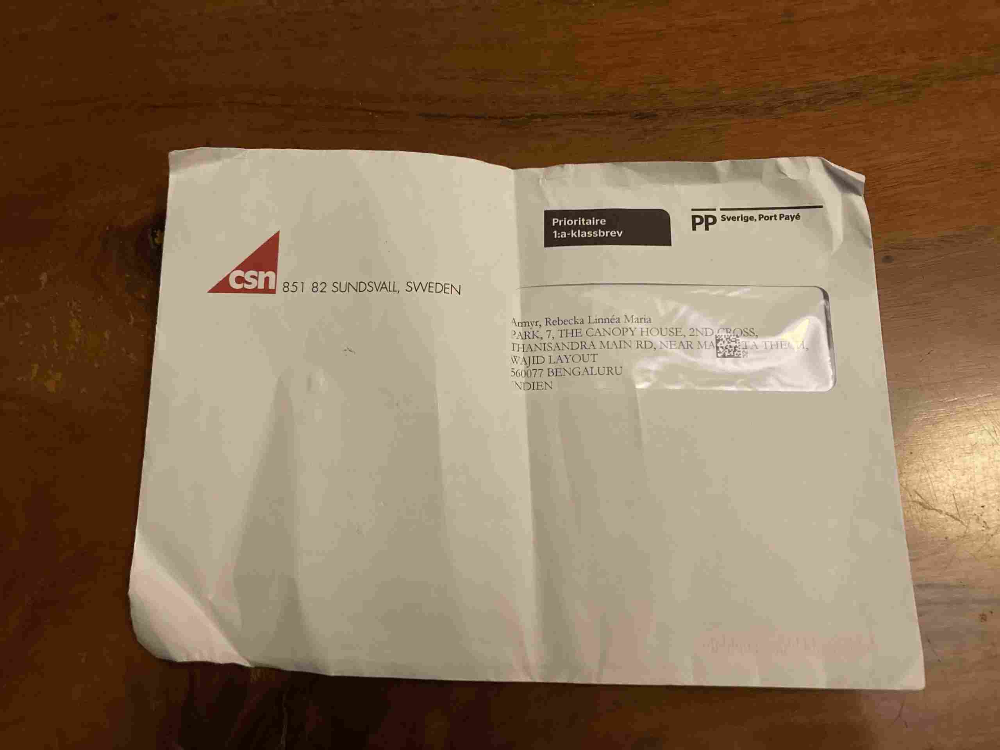
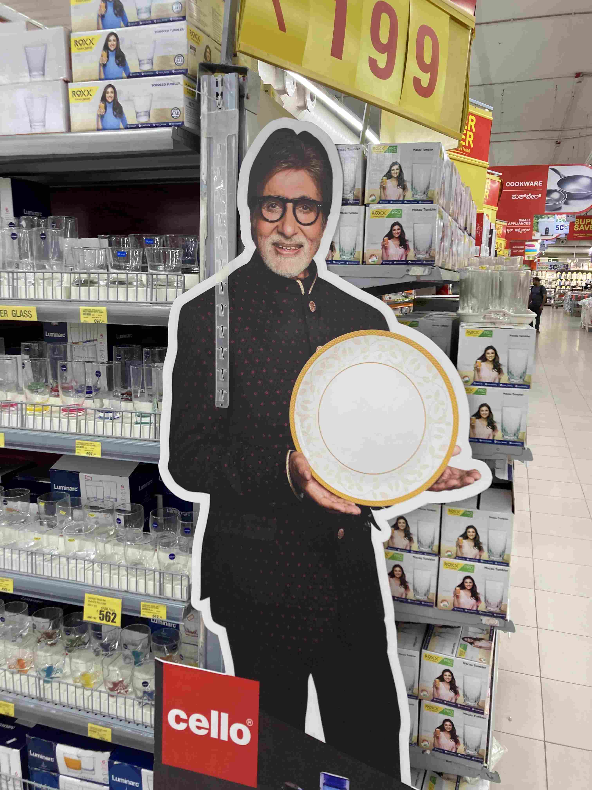

+++
title = 'Friskvard Och Lyx'
date = 2022-09-11T00:00:00+00:00
draft = false
featured_image = "IMG_1057-2.jpeg"
+++

 Helgens projekt var att undersöka ett studsmatte- och lekland i sydvästra Bangalore. Restider varandes vad de är (Minst en timmes resa) så bestämde vi oss också för att kolla in ett lyxhotell i närheten och göra det till en helhelg.
 

 Men först ett besök hos lokala frisören. Farmor har varit husfrissör i alla år, men även proffs har sin plats. Vi plockade också upp skoluniformerna som till slut har kommit.
 

 
 

 
 

 Lyx var helgens tema så vi betalade in oss på ett pass på fyra timmar med fri tillgång till allt. Så ja, vi tog en paus på 30 min för att äta, och två korta pauser för en höghöjdsbana och el-sladd-cyklar (Tihi, sladd här betyder att de var byggda för att sladda hela tiden….) men i övrigt så hoppades det i princip utan avbrott. Våga vägra stillasittande barn…..
 

 När vi till slut var färdiga, så tog vi in på femstjärningt hotell och åt Italiensk middag (Rätterna var riktigt bra, men de behöver skärpa till sig på lite saker runtikring om jag skall bli stammis).
 

 Hotellet i övrigt var helt oklanderligt och hotellfrukosten i världsklass. Givetvis med både omelett, pannkaka och dosa som tillagas a la minute.
 

 Träden ni ser mellan glaset och väggen är utomhus, och i utrymmet de växer så flög det ner färgglada tropiska fåglar med vackra röda kinder och med spetsig svart mössa. Jag gissar att det var en slump, men om det var med flit någon planterade just dessa träd för att locka till sig just denna fågel i urbana Bangalore och lyckades så har jag aldrig varit mer imponerad i mitt liv. Lite så här såg fåglarna ut, fast byt ut de gula mot svart och vitt.
 

 I förra inlägget pratade jag om att det blev en spontan helgdag för att det hade regnat ganska mycket. Några dagar senare fick vi se det själva med egna ögon. Detta är inne i Manyata Tech Park, ett av de modernaste och mest påkostade kontorsmrådena i Bangalore där ett enda bolag byggt precis allt från grunden med skattesubventioner mot att företag här måste anställa Indier. Det här var den mindre av pölarna.
 

 
 

 Ja, vi har också fått reda på vilken myndighetssveriges längsta arm är, och det är visst CSN. Bilden bland svenskar här är visst att även om man så flyttar ut i någon liten by och inte berättar för någon så kommer CSN-breven fram. Inte ens skatteverket är visst så ihärdiga. Även för vår del så blev vi inte besvikna.
 

 Avslutningsvis så tänker jag kosta på mig att göra mig lite lustig över denna person. Han är en känd skådis här, och hans bild finn ÖVERALLT. Det finns inte en matbutik eller en motorväg där man inte ser hans ansikte, gärna på fem olika produkter samtidigt. Han fnyser åt Blondinbella och Therese Lindgren och kallar dem för amatörer. Gammal är faktiskt äldst när det gäller att kränga sitt personliga varumärke och här ser ni mästarnas mästare.
 

