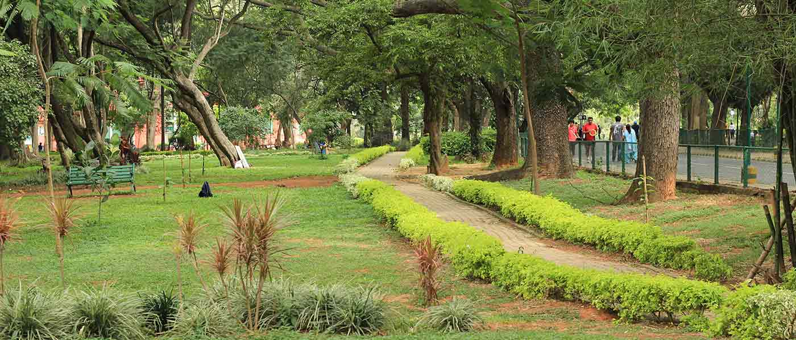
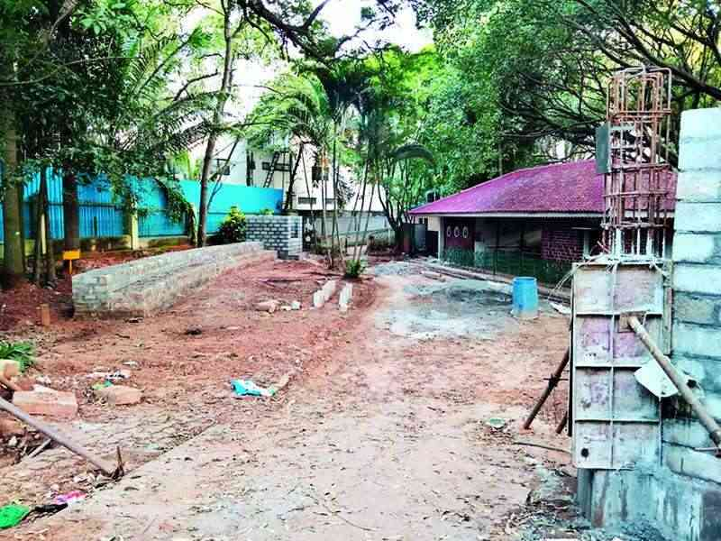

+++
title = 'Kortbesok Till Cubbon Park'
date = 2022-09-25T00:00:00+00:00
draft = false
featured_image = "Cubbon-Park-Bangalore-1400.jpeg"
+++

 I Bangalores absoluta mitt, tvärs över från stora regeringsbyggnaden och omringandes högsta domstolen ligger Cubbon Park. Söker man på saker att göra med barn i Bangalore så kommer denna alltid med på listan. Det är faktiskt Cubbon Park ni ser till vänster i rubrikbilden på denna blogg-sida.
 

 Och vilken skillnad mot resten av Bangalore! Som jag nämnt så är bristen på sop- och avloppshantering något som ställer till det för mycket av det offentliga utrymmet här i Bangalore, men denna park är ett undantag. Inga bilar tillåts. Ingen mat får tas med in. Istället är detta en oas där man får gå runt både på vägar och på gräsmattor. Med tanke på hur många människor som bor här så hade man kunna tro att det skulle vara överfullt med folk, men verkligen inte.
 

 Lånad bild
 

 Det utlovades en lekpark/minitivoli, men vad jag gissar är två år av Corona-nedstängdhet har räckt för att djungeln skall ha tagit över med skrämmande fart. Man har dessutom lagt energin på att renovera upp ett hörn av parken för att göra en plats exklusivt för barn med fysiska funktionshinder. Nu håller man på att renovera resten av lekparken med och enligt ryktet skall det vara klart om bara två månader.
 

 Lånad bild
 

 Lånad bild
 

 Lite besvikna på att ytterligare en plats som det talats så väl om inte riktigt levde upp till förväntningarna så bestämde vi oss för att göra något annat resten av eftermiddagen. Men på vägen ut så gick vi förbi en rejäl granitklippa som stack upp ur marken. Solvarm och len och perfekt för att sätta sig ner och återknyta kontakten med jorden och marken för en stund.
 

 I övrigt så har en kattunge flyttat in i huset. Och lärotemat ”hävstång” är en utmärkt ursäkt att bygga en katapult i skolan
 

 Efter en knapp månad då kontoret här varit stängt för renovering och vi återigen tvingats (Till de flestas men inte allas glädje, skall dock tilläggas) jobba hemifrån så kommer kontoret öppna igen på måndag. Det ser jag väldigt mycket fram emot.
 

