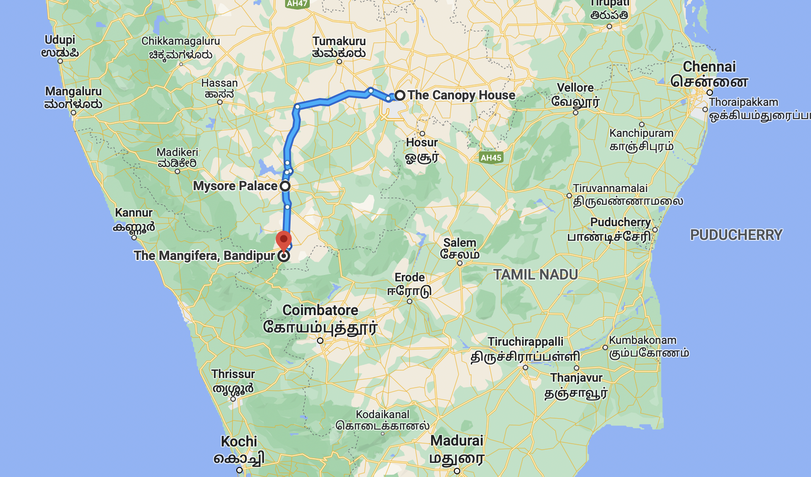
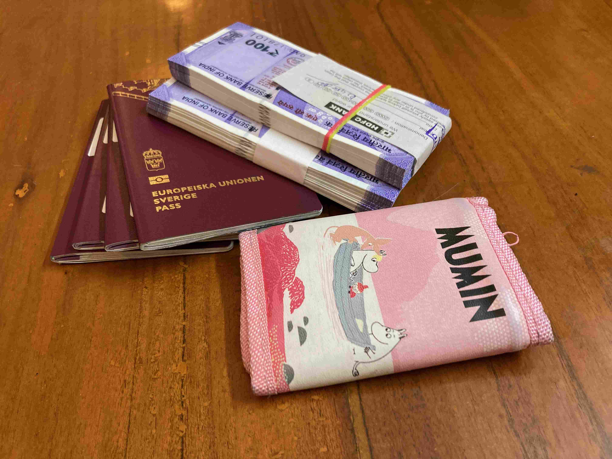
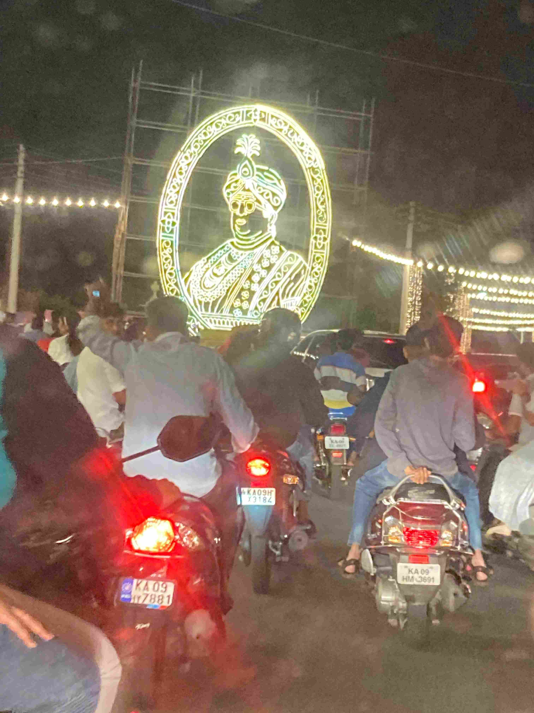

+++
title = 'Aventyrs Oktober'
date = 2022-10-03T00:00:00+00:00
draft = false
+++

 Två av de stora årliga högtiderna i Indien ligger i Oktober. Dussehra och Divali. Skolan firar Dussehra med ett en och en halv vecka långt höstlov som börjat nu, och Divali med tre lediga dagar i slutet av Oktober. Kombinerat med en kortresa med jobbet jag gör tillbaka till Sverige(!) betyder att jag inte kommer jobba många vanliga arbetsdagar denna månad.
 

 Så efter en extremt vardaglig September så är vi nu alltså i Äventyrs-Oktober som är lite mer fotogeniskt. Så knappt 3 dygn in så finns et material för ett första inlägg.
 

 På samma vis som att Midsommar firas intensivast i Dalarna, så firas Dussehra som intensivast i Mysore, en av Bangalores närmare grannstäder. Så det är klart vi behövde åka dit. Själva höjdpunkten händer på Onsdag, tror jag, och då är det så fullt med folk i Mysore att till och med infödda Indier skakar lite oroligt på huvudet. Så vi passade på att åka dit lite tidigare för att hinna lämna innan de stora massorna dyker upp.
 

 Jaja, nog med prat. Var är bilderna?!
 

 Först lite kontext. Här är vår resa hittills, från The Canopy House där vi bor, via Mysore och nu sitter jag på The Mangifera och skriver detta.
 

 Resan började med tåg. Första-klass med AC, givetvis, vilket motsvarar upplevelse av att åka Snälltåget med sina vagnar från 60-talet i Sverige. Vi har laddat upp med reskassa och tåget som stod och väntade hade påpassligt reklam för två av orderna vi skall besöka lite senare.
 

 Väl framme så tog vi en taxi till hotellet, och taxichauffören var riktigt sugen på att vi skulle boka honom resten av dagen så han kunde visa oss resten av Mysore. Han gav ett gott intryck så vi sade ja. Det var ett riktigt bra val för han tog först med oss ut till en park nedanför dammen till en av de stora vattentäkterna i den här delen av Indien. Liksom Cubbon Park så är det här också en park där man faktiskt ser till att det är rent och snyggt. Så det är klart att jag tog chansen att ligga och vila lite på rygg direkt på marken. Mitt nya signum?
 

 Och när man har en stor damm, så blir fontäner plötsligt ganska enkla att bygga och billiga i drift…
 

 
 

 
 

 På kvällen så tog föraren oss genom innerstan, och medans barnen sov sött i bilen så kunde vi vuxna titta på staden som är helt upplyst på nätterna denna vecka, speciellt det kungliga palatset. Vi höll kanske en snitthastighet på 2 km/h, för nu fick vi ett första smakprov på den trängsel som vi blivit varnade för.
 

 
 

 Och på tal om det kungliga slottet i Mysore (Mysore var en gång i tiden huvudstad för ett av kungarikena härikring) så åkte vi dit med dagen efter. Och vad roligt det var att se en kulturarvsbyggnad som faktiskt underhålls. Jag håller tydligt på att bli lite av en byggnadsnörd, men det gav mig på riktigt ro i själen när jag såg att det här slottet var byggt att hålla i århundraden och att det faktiskt tas om hand om så att den drömmen kanske blir verklighet.
 

 Och ja, det där sakerna som ser ut som om de är byggda helt i blommor, är byggda helt i blommor.
 

 Under veckan pågår också en kulturvfestival i allmänhet, och jag tar mig friheten att utnämna veckans tant. Kolla vilken känsla och pondus hon i mitten har. Jag har tittat lite på Indisk musikteori och jag tror (Men kan ha fel) att det här är helt improviserad musik.
 

 
 

 Efter en tur genom slottet så åkte vi vidare till Mysores Zoo. Ytterligare en attraktion i toppklass med stora burar, fulla med många pigga djur.
 

 
 

 Efter ett helvarv runt Zoot så var det middagsdags och sedan hade solen gått ner. Eftersom vi var inom gångavstånd från slottet så tog vi barnen med på en kvällspromenad. Indien har ju i allmänhet en avslappnad attityd till vilken trafik som hör hemma var, och när det blir folkfest så släpper man sådana tankar helt och hållet. Den här typen av stämning har i alla fall inte jag upplevt sedan Daniel och Viktoria gifte sig i Stockholm.
 

 Och som vi märkt, när Indier blir uppsluppna, då vill de ta selfies med västerlänningar. Vissa är jättetrevliga och då är jättekul, som en hel skolklass eller de unga killarna nedan. Andra har ett mer privligerat förhållningssätt och får sig ett artigt och sedan ett mindre artigt nej, något jag känner igen från en viss nyckelfråga inom feminismen….
 

 
 

 Vi förstod att det skulle bli svårt att få tag i en taxi hem när trafiken såg ut som den gjorde, så det blev en ganska lång och sen promenad innan vi kom tillräckligt långt bort för att det hela skulle flyta igen. Totalt blev det 10 timmars vandrande och 28 tusen steg med bara korta pauser för att äta och fika, men bara glada miner från alla nästan hela tiden.
 

 Idag var det lugn och ro i en lekpark och taxi till The Mangifera, ett minihotell med stora gräsmattor och pool. Fantastisk personal, riktigt trivsamma gamla men välunderhållna hus och en middag i toppklass bådar gott för de kommande dagarna vi skall vara här.
 

