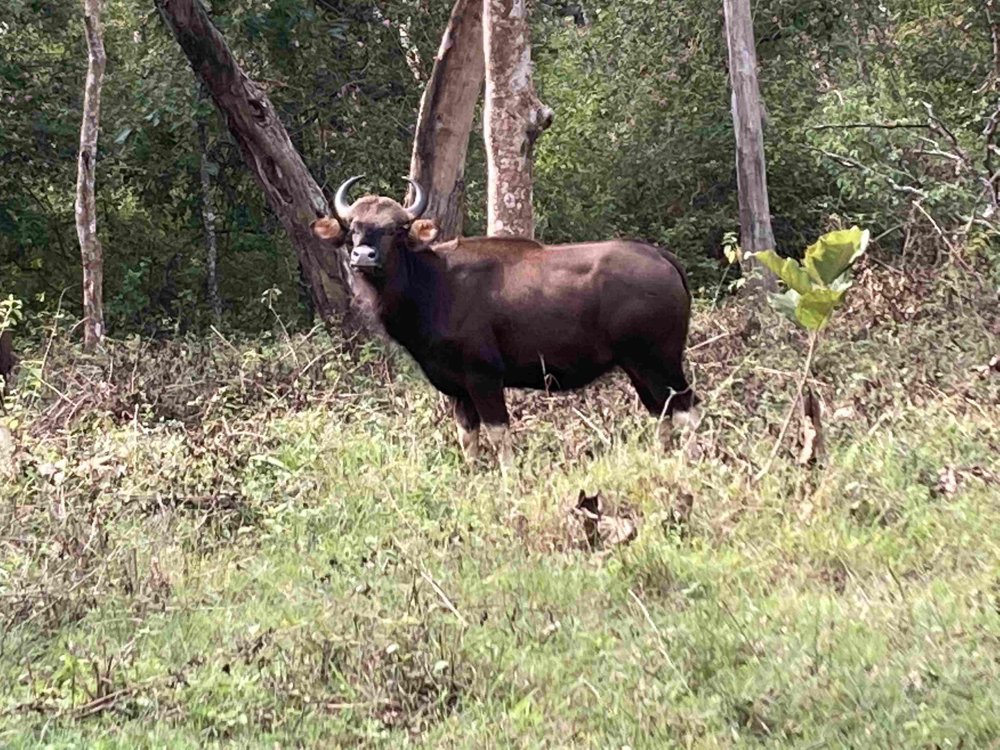

+++
title = 'Aventyrs Oktober Del 2'
date = 2022-10-05T00:00:00+00:00
draft = false
featured_image = "IMG_3284.jpeg"
+++

 Denna resa fortsätter med att överträffa förväntningar. Ren natur är som sagt en bristvara i södra Indien, men här i Bandipur så har vi hittat en oas där naturen tas om hand om, trots att det förstås är väldigt mycket folk här med.
 

 Huvudattraktionen här är Bandipur Tiger Reserve, ett gammalt kungligt jaktområde som numer är nationalpark. Det är just nu hem till 2000 elefanter och nästan 200 tigrar som är det stora dragplåstret.
 

 Här stannar vi i hela tre nätter på hotellet The Mangifera (Mangifera är det latinska namnet på Mangoträd) och det är ett litet hotell som består av en gammal bondgårdsbyggnat ombyggt till fem hotellrum och en restaurang i närheten. Emellan dem ligger en badbassäng och runt alltihop är det en väl tilltagen plantering av kokospalmer.
 

 Nedan ser ni huset. Våra två rum ligger bakom de inglasade balkongerna till höger i bilden.
 

 Även om vi är på samma höjd som Bangalore så är växtligheten helt annorlunda här. Här är det mer gräs och träiga buskar vilket binder marken bättre än i Bangalore. Till min stora glädje så har jag till slut hittat äkta ”rör-mig-ej”-växter, en rolig växt som frodas i Centralamerikas högre landskap. Den Schweizerkniv som jag fick när vi bodde där fix nu en liten återträff, så där 30 år senare.
 

 Så varför heter växterna ”rör-mig-ej”-växter? Nils får förklara:
 

 
 

 Så var det dags att åka ut på safarin. Vi hade tur och fick se det mesta av de kändaste djuren. Vi börjar med ett litet kollage av de lite vanligare djuren. När guiden inte ens bemödar sig om att nämna påfåglar så vet man vad man har att vänta.
 

 Näst mest populär i parken är elefanten. Vi hade turen att se en hane, något som är ovanligt då de rör sig ensam och därför är svårare att få syn på än honorna som rör sig i flock. Rebecka lyckades dessutom se den innan guiden…
 

 En annan evig tvåa är Leoparden. Tyvärr så är det i princip omöjligt att faktiskt se den i bilden till höger, men på grenen till höger i det stora bruna trädet så ligger det en Leopard och tuggar på ett rådjur. När till och med guiden tar fram sin kamera och sedan skrytvisar bilden för de andra guiderna, då vet man att man sett något speciellt.
 

 Men huvudnumret är som sagt tigern. Ungefär var tredje tur får se tiger, och vi hade bokat två turer, så skulle vi få se en?
 

 Spåren fanns där. Färska tigerspår i leran, och rejäla klösmärken för att markera revir.
 

 Men till slut, djupt inne i snårskogen, så träffade vi på Sundri. Hon är sex år gammal och har inte synts till på tre månader. Också hon blev föremål för en hel del skrytande guider emellan. Det är ny vecka, så hon kanske blir denna veckas tant.
 

 
 

 Nu är vi tillbaka och vi väntar på lunchen på bästa möjliga sätt. En fjäril tar dessutom chansen att foto-bomba vår slowmotion-film.
 

 
 

## Reflektion

 I går kväll när jag barfota klev ut på gräsmattan utanför vår lilla stuga och in under de lummiga träden i kvällsmörkret så slogs jag plötsligt av en känsla.
 

 Jag har, sedan någon gång i våras, till slut insett att jag inte är en stadsmänniska. Jag har varit det under en period i livet, men digitaliseringen utveckling och min egen förändring har nött bort stadens fördelar en efter en. Några få finns kvar och tippar fortfarande över vågskålen till Stockholms fördel, men många av dem har ett utgångsdatum.
 

 Känslan jag fick var den där känslan av absolut stillhet, och vissheten av att jag behöver kunna gå barfota på marken bland träd med viss regelbundenhet för att kunna känna mig hel.
 

 Men sedan kom direkt en mot-tanke som sade ”Men vadå, du har ju aldrig varit still mer än 5 minuter i ditt liv. Du är ju hela tiden i rörelse och tycker stillhet är jättetråkigt”.
 

 Och då hände något spännande. Dessa två tankar möttes och bildade en helhet som är banal på ytan men som jag nu tror att jag förstått på ett djupare plan. För att kunna röra oss snabbt på ett sätt som påverkar oss om vår omvärld på djupet så behöver vi rötter och stillhet.
 

 Det här är något som vi arbetar med på jobbet just nu. Hur kan vi skapa något som kräver en jättestor mängd kreativitet, i extremt hög hastighet. Svaret har varit välkänt sedan i alla fall mitten av 90-talet. En viktig del av svaret är att det alltid skall finnas en bergfast grund att stå på. Då kan nästa steg kan tas med fullständig tillit om att det som ligger bakom inte kommer sätta käppar i hjulet. Framtiden innehåller nog med osäkerhet utifrån utan att man fyller på.
 

 Jag har läst detta och tillämpat det i många år. Nu tror jag att jag förstår den tankens inne väsen. Det här är nog ett korn av det som kallas visdom eller upplysning, och det har värde.
 

 Så nästa fråga blir: Hur kan visdom som tar decenier att uppnå fungera i en föränderlig värld? Jag har faktiskt läst ett antal svar på den frågan med och de är lika eleganta som de är banala. Ge mig ett årtionde till så kanske jag dessutom förstår dem.
 

