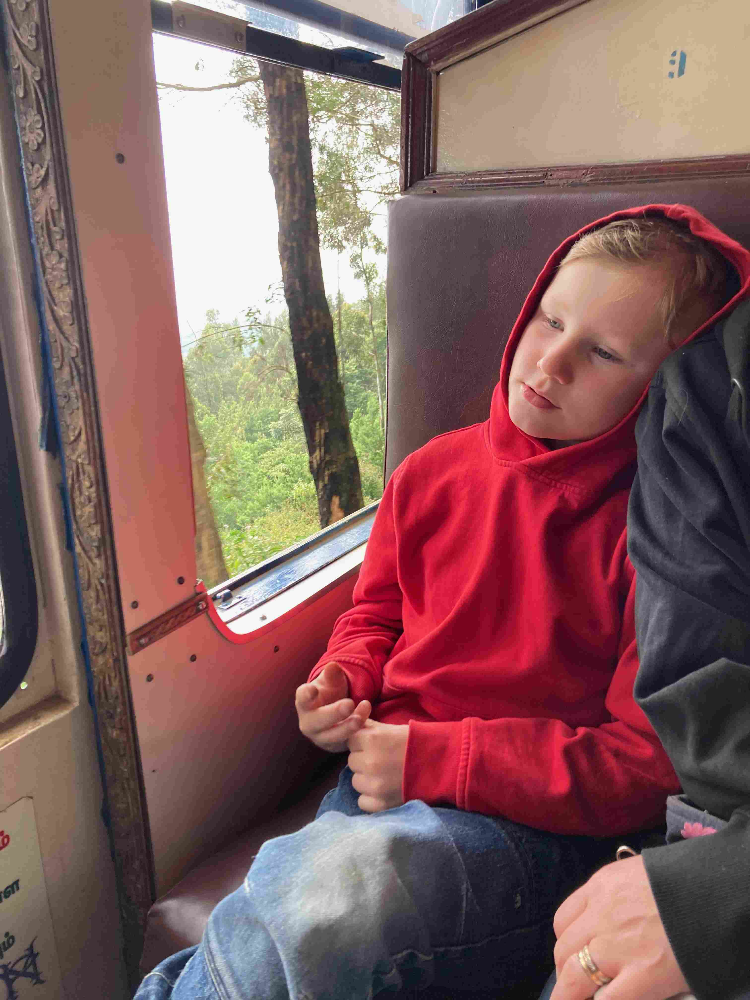

+++
title = 'Aventyrs Oktober Del 3'
date = 2022-10-08T00:00:00+00:00
draft = false
featured_image = "IMG_4301.jpeg"
+++

 På vår 10-åriga bröllopsdag så var det dags att lämna paradiset som Bandipur var och ge oss upp i bergen till lite mer Svenska temperaturer. Hotellet tog i lite extra med bordsdekorationerna till vår sista lunch. Och aporna tog farväl de med.
 

 Vägen till vår nästa stopp, Ooty tog oss genom tigerparken en sista gång, och även en elefant passade på att önska oss lycka till på färden.
 

 Ooty ligger på rejält över 2000 meters höjd, och det var svinkallt! Sjutton grader må vara ganska trivsamt när luften är torr och man har varma golv och ullkläder. I en stad med stengolv, hus med extra bra ventilation och ren bomull så var det precis så hemskt som vi Svenskar gärna hävdar.
 

 Vi tog oss till stans bästa restaurang för att äta en civiliserad årsdagsmiddag, men kylan, trötta barn, och den tyvärr inte helt smickrande jämförelsen med den sjukt bra maten på hotellet innan gjorde att det hela blev lite av en icke-händelse.
 

 Ooty var mest tänkt som en övernattning inför en av resans planerade höjdpunkter. The Toy Train är ett bergståg som går från Ooty och ner till låglandet. Trots att vi bokade flera månader i förväg så var biljetterna på den längre resan redan slut. Men vi kunde i alla fall åka halvvägs till Coonoor vilket var trevligt nog.
 

 
 

 
 

 
 

 Coonoor är en sådan där liten pärla som ligger nära mer kända platser och därför inte ”förstörts av turister”. Vi checkade in på ett homestay av bättre sort och började med att ta en promenad upp på bergen och de teodlingar som täcker varenda bergssida runt denna by. Jag passade på att plocka lite nyutslagna blad för att prova att göra te på färska teblad. Smaken blir sjukt subtil och elegant. Ja, om jag kunde så skulle jag bara dricka färskt te.
 

 Dagen efter så hade vi bokat en halvdagstur med en lokal auto-chaufför. Först ut var en teodling där man fick gå runt bland buskarna.
 

 Sedan fortsatte färden vidare till ett antal utsiktsposter. Coonoor ligger precis på kanten av Nilgiribergen som har en extremt abrupt gräns mot plattlandet nedanför. Det ser ut som om berget väckats ihop, och sedan fått rejäla förkastningsbranter i dess utkant.
 

 Den här lilla typen måste ju få en helt egen bild. De är sjukt gulliga dessa små, tills man tar fram fikat. Då visar de att de har både tänder, klor och attityd.
 

 Sammanfattningsvis är det denna resa vi gjort de senaste dagarna.
 

 Till i morgon har vi hyrt heldagstaxi för att hinna med resten av sevärdheterna i detta område. Sedan skall vi prova på äventyret sovbuss som med lite tur tar oss hela vägen hem till Bangalore och slutet av denna första etapp av Äventyrs-Oktober.
 

