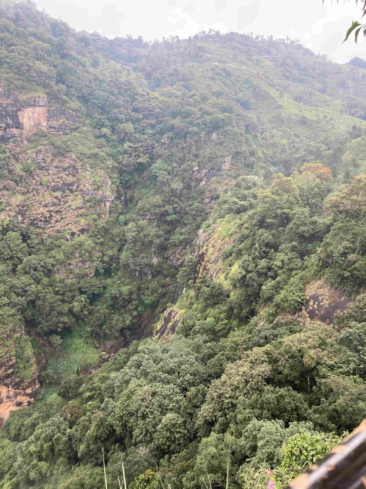
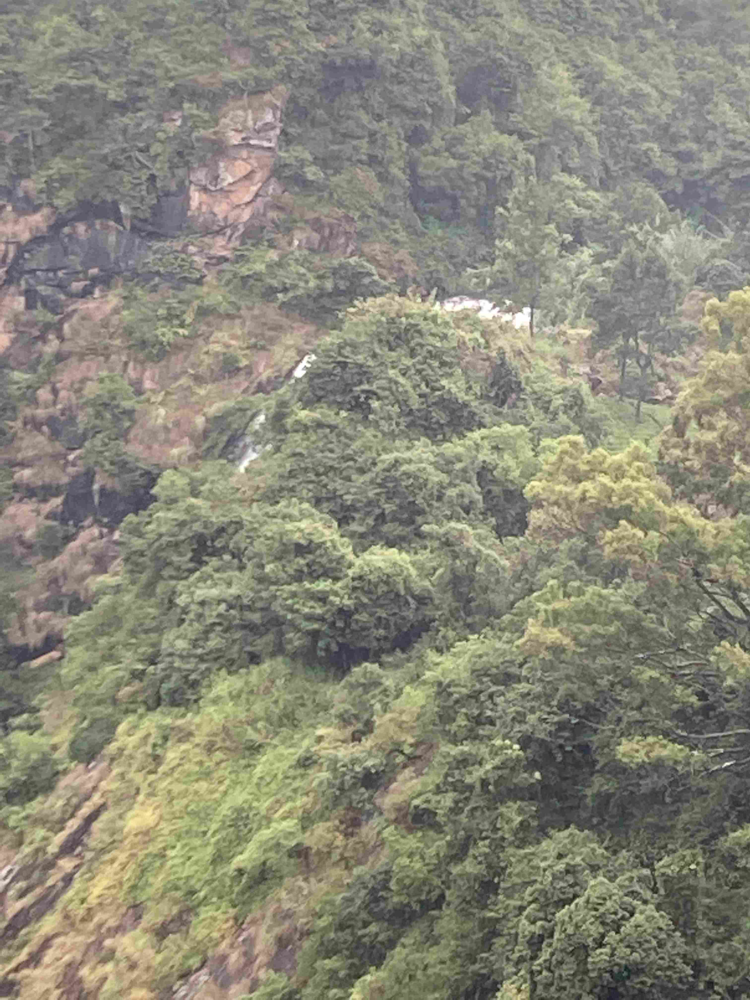
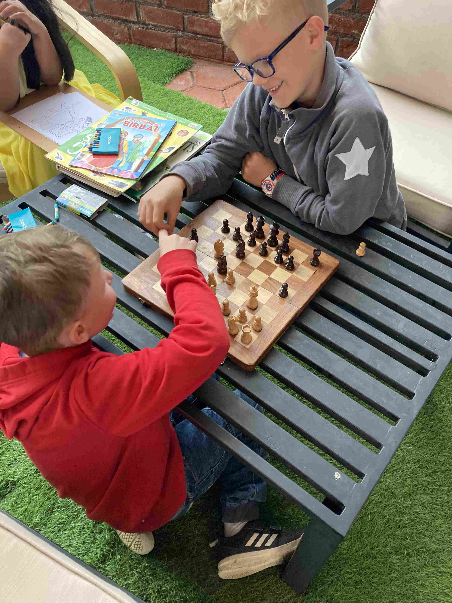
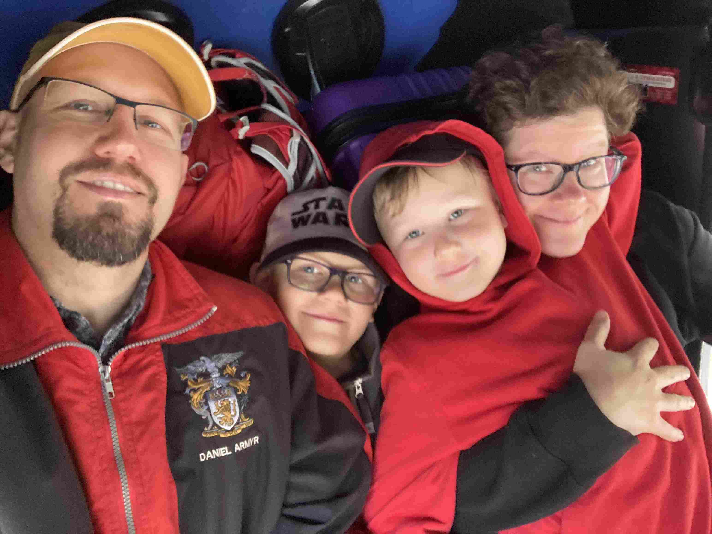
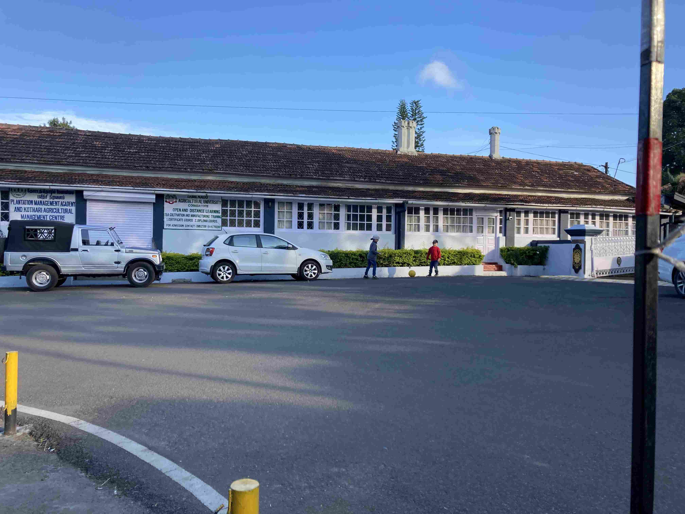
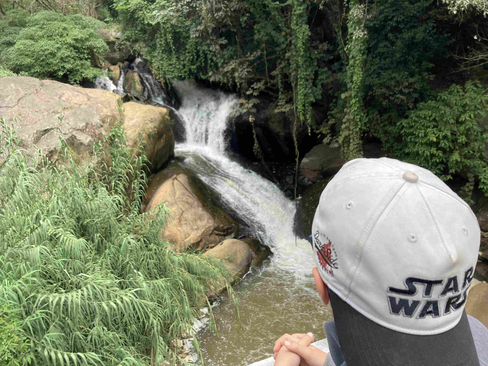
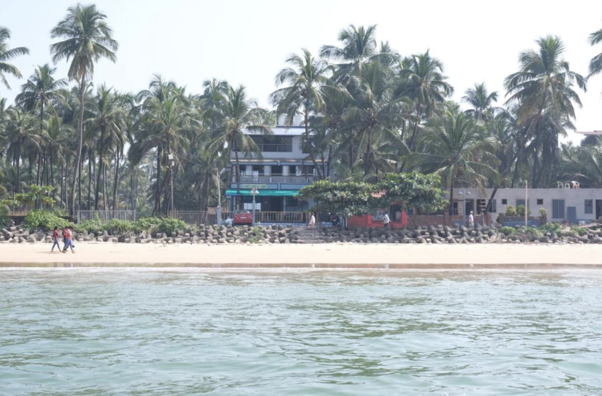

+++
title = 'Aventyrs Oktober Del 4 Slut Pa Forsta Etappen'
date = 2022-10-16T00:00:00+00:00
draft = false
+++

 Jo, vi överlevde resan och är alla hemma i lägenheten i Bangalore nu. Tillbaka till en vardag med 27 grader, korsdrag och böneutrop.
 

 Resan avslutades med en dag till i Coonoor, där vår mycket trevliga auto-chaufför körde oss till andra sidan dalen för att titta närmare på det stora vattenfallet som vi hade sett på avstånd dagen innan. Det var ett fall där resan blev större än målet.
 

 Över en timmes resa enkel väg, och när vi väl kom fram så kunde namn knappt se vattnet från utsiktsposten, och på grund av att det är regnperiod så fick man inte gå på stigen som annars tar en fram till en badplats mellan två fall heller.
 

 Men på vägen dit stannade vi på lunchrestaurangen ”The Hobbit” som hade Ikea-möbler och ett schackspel under ett plåttak som fick den helt normala tropiska regnskuren att bli öronbedövande.
 

 Trots att dagens höjdpunkt blev lite inget av något så ångrar jag alls inte resan. Det var mysigt i den minimala auton, och i alla fall jag känner att en dag till av snirklande genom bergssidornas teplantage gav mig en djupare anknytning och förståelse för platsen.
 

 I övrigt så tittade vi på ett mindre vattenfall, lekte/sov i en lekpark och avslutade med lite fotboll på gatan utanför en våffelrestaurang ägd av en riktigt trevlig familj där en av dem hade varit både i Malmö och Helsingfors.
 

 
 

 Vägen hem var det sista äventyret med sov-natt-buss. Som koncept, ganska smart och bra. Att det började med en timme av serpentinväg, kanske mindre bra. Så det gör vi nog inte om. Men utan serpentinväg och med en riktig kudde så hade jag nog trivts rätt bra.
 

 Dagen efter så hade jag en jobbresa tillbaka till Sverige. Så nattflyg till europa, två dagars ledarskapskonferens, och sedan flyget hem till Bangalore igen. Redan när jag landade i Sverige så insåg jag att hela det besöket skulle kännas som en dröm när jag var tillbaka. Så det kanske det var.
 

 Men en morgonpromenad längs Norrmälarstrand med några Indiska kollegor gjorde gott för själen.
 

 Nu kommer en vecka av vanlig vardag igen innan vi ger oss av till Mālvan. Mālvan är en by lite norr om Goa som enligt alla listor har bästa snorklingen på Indiska fastlandet. Dessutom är den här byn så liten att inte ens de flesta Indier ens hört talas om den. Så det kan bli oväntat åt alla håll. Här är en liten förhandstitt:
 

