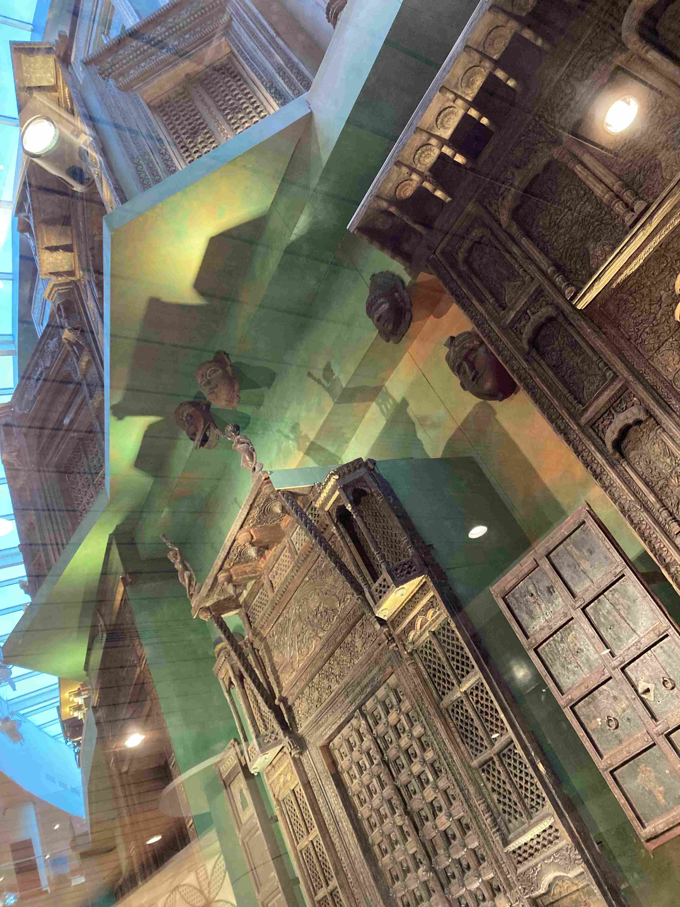

+++
title = 'Aventyrs Oktober Etapp 2'
date = 2022-10-26T00:00:00+00:00
draft = false
featured_image = "IMG_3517-1.jpeg"
+++

 Denna vecka är det Diwali, ljusets festival. Den fyller lite samma roll som jul och nyår tillsammans och är en av de stora högtiderna under året. Skolan var stängd hela måndag till onsdag och då var det långresedags igen!
 

 Denna gång har vi valt att tumma lite på principerna och nöjesflyga, något vi inte gjort sedan Isak vad nyfödd. Men det gick inget direktflyg, så det blev mellanlandning med övernattning i Mumbai, en mycket varmare stad än Bangalore. Så givetvis var det dags att fram våra hoodies, för desto varmare det är ute, desto kallare verkar man sätta luftkonditioneringen.
 

 Väckarklocka satt till 05.00 är ett rimligt pris att betala på ett äventyr som detta, och snart var vi alla pigga och vakna. Mumbais flygplats hade en konstnärlig installation gjord av gamla dörrar.
 

 De här dörrarna har en särskild plats i vår familj på grund av hur de spritt sig över världen till platser vi bott. De vassa spikarna är till för att inte elefanter bara skall buffa sig igenom dem. Araberna tyckte de att de såg fina ut och plockade upp trenden. När de invaderade/bosatte sig i Spanien så såg Spanjorerna dem och också de hakade på denna design. Conquistadorerna med sig stilen till Latinamerika, och i Europa så spred trenden sig norrut ända till vårt härbre i Bjursås där mönstret förvisso hamnat på sniskan och spikarna försvunnit. Men som min kusin Jens argumenterat som del av sin forskning: Idén om att en globaliserad värld skulle vara något nytt är bara hittepå.
 

 Sista delen av resan var förhållandevis händelselös. Litet flygplan och liten Auto.
 

 Platsen vi skulle till, Malvan och Chilla Beach är ett ganska okänt mål. De flesta av mina kollegor hade aldrig hört talas om det och transportmöjligheterna var som sagt begränsade. Men alla listor över “bästa snorklingen i Indien” har med denna plats som den enda på Indiska fastlandet. Så det här kunde gå lite hur som helst. Antingen fantastiskt eller en total besvikelse. Jag låter bilderna tala för sig själva.
 

 Vi tillbringade i princip vår vakna tid med att antingen flyta 30-gradigt guppande vatten, eller med att vila upp oss med varsin bok från ansträngningen av att ligga och flyta i 30-gradigt guppande vatten.
 

 Den stora attraktionen här är ett gammalt fort som byggdes på 1600-talet, i form av en ö helt omringad av höga murar. Här tramsar man inte runt med massa staket och sådant utan det är fri lek på eget ansvar.
 

 
 

 Sista morgonen innan flyget hem så gick vi ner på stranden för att ta farväl. Då hittade vi denna stackare som inte var död, men för trött för att ens orka simma. Så fast vi försökte få ut den i vattnet två gånger så slutade den på rygg på sandstranden ändå…
 

 Nu sitter vi på planet på väg hem. Efter Äventyrs-Oktober väntar Vardags-November som sedan följs av jätte-långt-julledigt-i-Goa-December.
 

## Reflektion

 Det var det där med att resa med flyg. Tåget har ju tyvärr sitt krux med att ett trasigt tåg stoppar upp precis alla annan trafik på rälsen i flera timmar.
 

 Men bränslefrågan satt åt sidan så blev det på just denna resa så tydligt hur absurt flygresor rent logistiskt går till. Mumbais flygplats har två terminaler som det tar en halvtimme att köra mellan. Hotellet vi bodde på låg precis vid den terminal vi ankom till, men avresan skulle ske från den andra terminalen. Så väckarklockan sattes på 05.00 för planet skulle avgå 08.00.
 

 Men planet vi flög med stod parkerat precis bredvid terminalen vid hotellet. Det är på riktigt max 15 minuters promenad från där jag tog denna bild till hotellet i kamerans riktning. Så vi lade 3 timmar på att göra något som borde gått på 1 timme, bara på grund av alla kontroller som krävs för att släppa på folk på en flygande sardinburk.
 

 PS. Flygplanet hämnades på mig genom att komma lite sent så att några som skulle till Singapore hade bråttom. Då försökte jag vara artig och flytta till en rad bakom efter vi landat så att de kunde komma ut snabbt och effektivt. Men för ovanlighetens skull hade jag lagt laptopen i stolsfickan framför och fick inte med den…. Så nu är vi en svindyr laptop kort. Förhoppningsvis bara tillfälligt.
 

