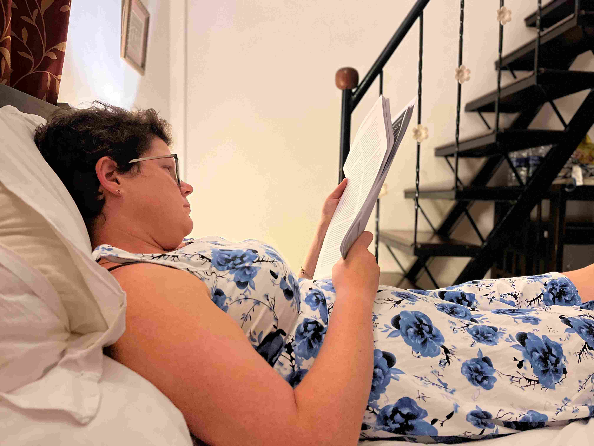

+++
title = 'Slappar December Del 1'
date = 2022-12-19T00:00:00+00:00
draft = false
+++

 Då var vi en vecka in i vår resa till Goa och Slappar-December. När skolan slutar den 9nde December och jullovet varar fram till nyår så tycker jag det helt klart är rätt namn på denna månad.
 

 Vi börjar med lite mer julpynt och får då inte glömma den traditionsenliga jul-cypressen. Rebecka hittade dessutom en fantastiskt smakfull belysning så att man nästan tror att man fortfarande är i Skandinavien.
 

 Skolan hade bjudit in till en skolavslutning av rang med start vid 13-tiden och avslutning med fyrverkerier någon gång efter 8 på kvällen. Tyvärr kom det in en cyklon och även om det hela var väldigt odramatiskt så hade vi ett par dagar med dåligt väder (Under 20 grader! och regn) så det hade inte varit så kul. De har lovat att den festen kommer hållas i Februari i stället. Så vi fick fira på egen hand. Det blev glass på ett ställe som förvisso hade europeiska priser, men också äkta Italiensk smak på glassen.
 

 Jag fick lov att samla ihop ett gäng komp-timmar som jag nu kan ta ut som heldagar. Rebecka lyckades beta av det mesta av plugget innan, förutom en tenta i förra veckan och en gruppmunta tidigare idag, så vi kommer båda kunna vara väldigt lediga.
 

 Tips till alla ungdomar där ute: Väljer man att plugga på en teknisk högskola så har man inte bara chans till ett välbetalt jobb, utan man får faktiskt möjlighet att ta ledigt och repa sig med jämna mellanrum under tiden. De andra universiteten väljer ju att med en illa maskerad sadism placera terminernas slut direkt efter stora helgdagar istället för precis innan. Det går ju emot precis allt om hur man skall tänka för att vara produktiv. Inte konstigt att världen ser ut som den gör.
 

 Men åter till oss och här och nu. Första dryga veckan som nu lider mot sitt slut har vi tillbringat på Chalston Beach Resort. Ett hotell direkt på stranden i Goa som ägs av en Svensk-Indisk familj. Fantastiskt harmonisk personal och all mat serveras med en “svensk” grönsallad som man faktiskt vågar äta. Livets små saker…
 

 Pool finns givetvis, och vi har i princip inte gjort något annat än ätit och hängt vid denna pool i en vecka vilket jag tror har varit bra för oss alla. Tyvärr så är vi mitt i djupaste vintern och det gör att pool-vattnet ”bara” är ca 27 grader, så man vill inte ligga i och bara slappa hur länge som helst. Till mitt Svenska jags totala förskräckelse så ser jag faktiskt fram emot den Indiska sommaren i April/Maj när det kommer vara 35+ grader och badsäsongen drar igång ordentligt.
 

 Men I brist på gym så gör man vad man kan för att hålla axelmusklerna i gång. Vi börjar få till ganska bra teknik….
 

 
 

 Ett par gånger har vi gått ner på stranden för att bada med. Tyvärr så är det badförbud precis utanför hotellet. Orsaken är lite oklar, men att Indier i allmänhet är dåliga på att simma misstänker jag är huvudanledningen.
 

 Vi Svenskar pratar ibland om vårt trygghetsknarkande, med trepunktsbälten och hjälmtvång. I Indien sitter man gärna med småbarn i knät utan bälte i 100km/h (Nej, det händer inte varje dag att man lyckas köra så fort, men det händer). Men så fort det finns någon form av offentlig anläggning, speciellt om det finns vatten i den, då anställer man en armé av personer och ger var och en av dem en visselpipa. Resultatet blir en hord av besökare som inte riktigt bryr sig om regler eller vad någon säger mot armén av personer med visselpipor som alla visslar och ropar motstridiga instruktioner.
 

 Något hundratal meter bort på stranden är det tillåtet att bada, och hittar man bara en viss distans till badvaktens megafon och visselpipa (Sist vi var där verkade han också vissla varje gång en våg var på väg…) och inte har något emot att det är fullpackat med folk, så är det riktigt trevligt. Både Nils och Isak har visat hur otroligt starka simmare de är genom att simma i över en timme genom vågor bitvis nästan lika höga som de själva är. Både Nils och jag har dessutom lärt oss att kropssurfa, något jag minns att jag aldrig riktigt fick till som liten.
 

 Igår kväll till middagen så var det en “Rajasthan Performance” innan finalen i fotbolls-VM började. Frågar man Indier vilka platser man behöver besöka här så är Rajasthan alltid med på listan. Vi västerlänningar känner platsen som det område som Disneys Alladin utspelar sig i. Showen började med lite svängig Indisk-Persisk-Arabisk musik, men så plötsligt kliver dansaren fram med en brinnande lykta på huvudet.
 

 Vad sade du? Något om att du tycker det är svårt nog att hålla koll på dina fötter när du dansar? Ja, du riskerar i alla fall inte att brinna upp om du kliver fel….
 

 Vi hade inte med något at fota med, så här är ett annat klipp som visar en liknande dans som hon gjorde.
 

 
 

 I morgon lämnar vi detta hotel och förflyttar oss till det lugnare Södra Goa.
 

## Reflektion

 Det finns mycket sagt om hur olika kulturer ser på vilka som håller varandra i handen och hur och när. Googlar man frågan i förhållande till Indien så får man upp en hel radda artiklar (Jag tror det egentligen bara är en artikel som ompuplicerats flera gånger) om att Indiska män håller varandra i handen. Det kanske de gör, det är inget jag funderat så mycket på. I Bangalore är min upplevelse snarare att ingen håller någon i handen.
 

 Istället så håller man personer om armen. Fram till nu så har jag mest sätt vuxna göra det med barn. Vill man hålla koll på ett barn eller hjälpa/dirigera det så gör man det inte genom att hålla fram en hand och låta dem ta tag i den, utan man greppar helt sonika barnen runt under- eller över-armen. Effektivt, ja. Signal om att barnets vilja/förmåga respekteras, nej.
 

 Men häromdagen nere på stranden så såg jag det dessutom mellan vuxna. Längs vattenlinjen så var det vuxna män som höll lika vuxna kvinnor (Antagligen deras fruar) om handleden i ett rejält grepp.
 

 Enda gången i Sverige jag sett något liknande är med personer med grava funktionshinder kopplat till motoriken som gör att de antingen inte kan hålla handen alls, eller att de riskerar att ramla när som helst och då behöver att någon kan ta tag i dem med lite kraft. Så min första undermedvetna reaktion (Och inte bara första gången jag såg det) när jag såg detta var att titta efter tecken på något hinder med balansen/motoriken hos den som blev hållen på det här viset. Hade jag bara sett ett sådant par så hade jag mest noterat det som en udditet, men nu var en hel handfull sådana par.
 

 Ja, jag tror att jag stannar där….
 

 Nu skall jag erkänna att jag själv fram tills inte så många år sedan gjorde något liknande med mina barn. De lade handen i min och grep om mitt långfinger. Då kunde de hålla mig i handen bekvämt och jag kunde omsluta deras hand med min hand. Men så lade jag lillfingret på andra sidan deras handled mot resten av fingrarna. Om jag då klämde ihop handen så fick jag ett järngrepp om deras handled som varken fall eller smitförsök kunde rå på. Men så länge de samarbetade så gav jag dem i alla fall illusionen av att vi höll varandra i handen på ett någorlunda jämbördigt vis….
 

