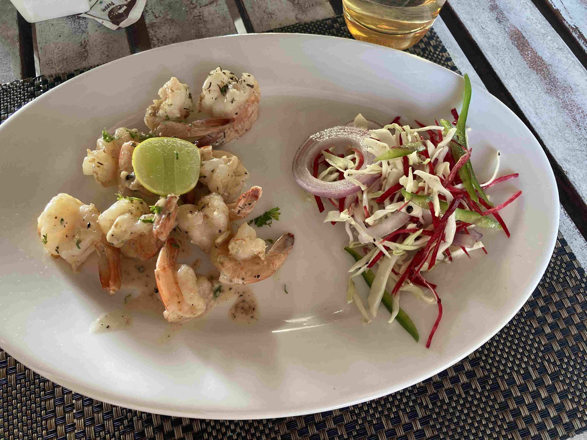
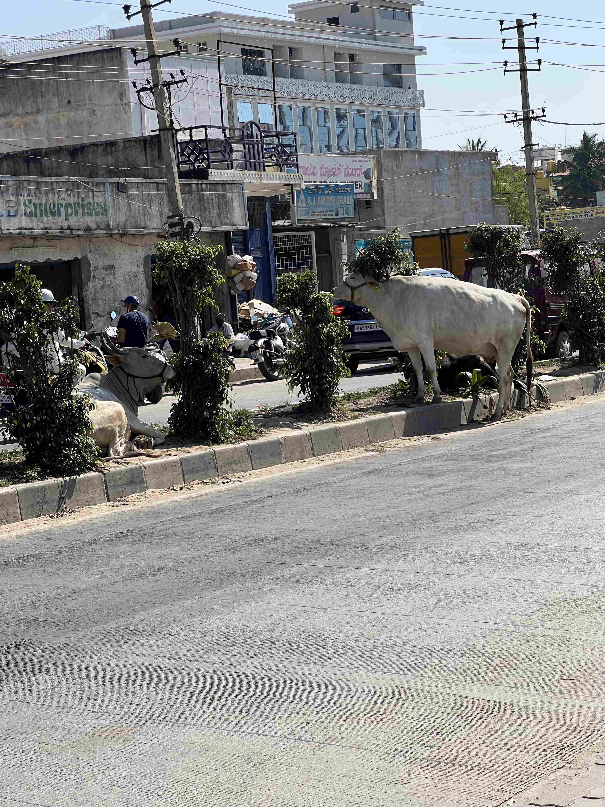

+++
title = 'Slappar December Del 2 Och Slut Pa Forsta Halvaret Har'
date = 2023-01-01T00:00:00+00:00
draft = false
featured_image = "Kenliworth-aerial-view.jpeg"
+++

 De senaste två veckorna har Rebeckas föräldrar, Anette och Göran, varit här på besök, och månade fortsatte i badets, solens och lugnets tecken.
 

 Det började med att vi checkade in i ett nytt hotell med en mycket större pool, som dessutom hade varmare vatten. Met vattenrutschbana och en del som var hela 3 meter djupt så fast det lite mer att göra än i Chalstons trevliga, men ganska enkla pool. Här en vy från luften från hotellets egna hemsida.
 

 Vi checkade in den 20nde och samma kväll hade de ett litet julevent med några barn från ett lokalt barnhem som uppträdde. Att höra vad som händer när Europeiska julvisor möter den Indiska musikkulturen som är mycket mer dissonant var spännande, kanske inte på ett helt bra sätt. Men det var roligt ändå.
 

 
 

 Dagen efter, drygt tolv timmar efter det var tänkt, så kom till slut Anette och Göran. Ja, att som svensk kraftelektriker se hur de gör saker här är en upplevelse….
 

 Vi tillbringade dagarna med att äta mat. Det blev räkor stekta i smör och vitlökssås minst en gång om dagen och Nils och Isak lyckades få hotellets ”Italienare” att göra en riktigt bra Hawaii, om än med många höjda ögonbryn.
 

 Det mesta av resten av tiden tillbringade vi vid poolen eller vid stranden.
 

 
 

 Men inte bara….
 

 Hotellets badrumsgolv hade nog den häftigaste stenbeläggningen jag sett. En svart marmorlik sten med stycken som glödde i blått när ljuset föll i rätt riktning….
 

 
 

 Och så var det solnedgångarna.
 

 Vi lämnade faktiskt hotellet mer än en gång med. Två gånger för att äta färsk fisk nere på strandrestaurangerna. Första gången blev det haj, krabba, kungsräkor och en vanlig hederlig tonfisk. Tyvärr så tillhörde den här restaurangen majoriteten här som översteker sin fisk. Men att barnen nu kan säga att de ätit haj och en räka större än deras hand är ändå värt något.
 

 Några dagar senare så gick vi lite längre till ett ställe som har lite bättre rykte, och det var minsann förtjänt. Barnen kan nu lägga till listan att de ätit en grabba större än deras huvud och en hummer stor som deras vadben.
 

 Rebecka och jag lyckades till och med ge oss av på en date night och såg Camerons senaste spektakel Avatar Way of Water, med en bytta popkort stor nog att bada i. Se nedan för en recension.
 

 Innan filmen fikade vi på ett väldigt Indiskt café. Efter filmen åt vi grillat kyckling på en Italienare driven helt av Indier som aldrig varit i Italien, men som faktiskt gjort sin läxa och verkligen fångat den europeiska restaurang- och matkulturen.
 

 Efter en dryg vecka i Goa så åkte vi hem till Bangalore. Vi besökte Cubbon Park, och till vår stora glädje så har min favvo-restaurang Sri Krishna the Daba öppnat igen. Det visar sig att ägaren fick någon skada eller något sådant, men nu har brorsan tagit över.
 

 
 

 Ja, och så var det nyår förstås…
 

## Reflektion 1: Avatar 2

 Nej, kanske inte riktigt samma wow-upplevelse som den första, men fortfarande en riktigt underhållande film. När jag läst recensionerna så verkar den mesta kritiken gå ut på att det är just Avatar och storfilm, snarare än att komma med någon vidare skarp analys.
 

 Men efter att ha sovit på saken så insåg jag att det finns en ganska uppenbar anledningen till den mest motiverade kritiken som går ut på att de vuxna kvinnorna i filmen har ganska små och ointressant roller. Filmens tredje huvudtema (De andra två varandes att valfångst verkligen är barbariskt, och den smärtsamma övergången från ungdom till vuxen), är utmaningen med den traditionella papparollen, specifikt i en flyktingkontext. Det sägs till och med rätt ut i filmen två gånger, så det krävs inte så många högskolepoäng för att identifiera detta tema.
 

 Men den papparollen och problemen med den kan bara finnas i en värld där vuxna män har dålig kommunikation i allmänhet och med vuxna kvinnor i synnerhet. Så då skulle kvinnorna behöva en engen parallel historia, vilket helt klart hade gjort filmen spretig.
 

 Så nej, denna film är kanske inte höjden av progressiv intellektualism. Men jag tror att den kommer att få hundratals miljoner vuxna män att på allvar fundera kring det destruktiva i den patriarkala / rovdriftskapitalistiska världsordningen. Så tror jag att filmen gör mer nytta än skada? Ja, det gör jag.
 

 Och så är den ju en naken kärleksförklaring till havet, något vi vet att regissören älskar passionerat. Och att göra en riktigt vacker hyllning till något man älskar, det är konst det med och har värde.
 

 Kommer jag att se nästa film i serien? Absolut.
 

## Reflektion 2: Första halvåret avslutat

 Då var första halvåret avslutat. Vad skall man säga? Inte så mycket mer än vad som redan skrivits här. Det kommer bli skönt att hitta tillbaka till ett riktigt vardagslunk. Nästan inga fler helgdagar fram till början av April. Livet kan inte vara äventyr varje dag, i alla fall inte för lågstadiebarn.
 

 Känner jag en brinnande längtan att förlänga och stanna kvar? Nej, i alla fall inte i Bangalore. Staden är för stor och smutsig, så är det bara. Och att allt roligt gått i konken under Corona gör inte saken bättre, tyvärr.
 

 Ångrar jag att vi åkte? Inte en sekund.
 

