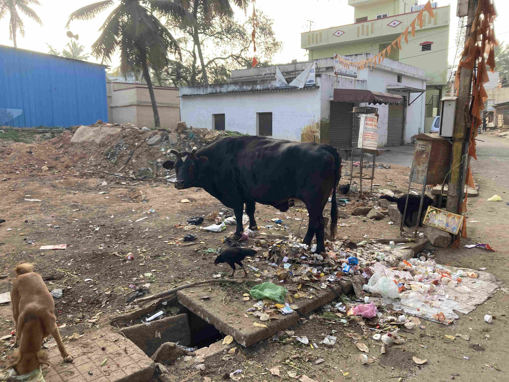
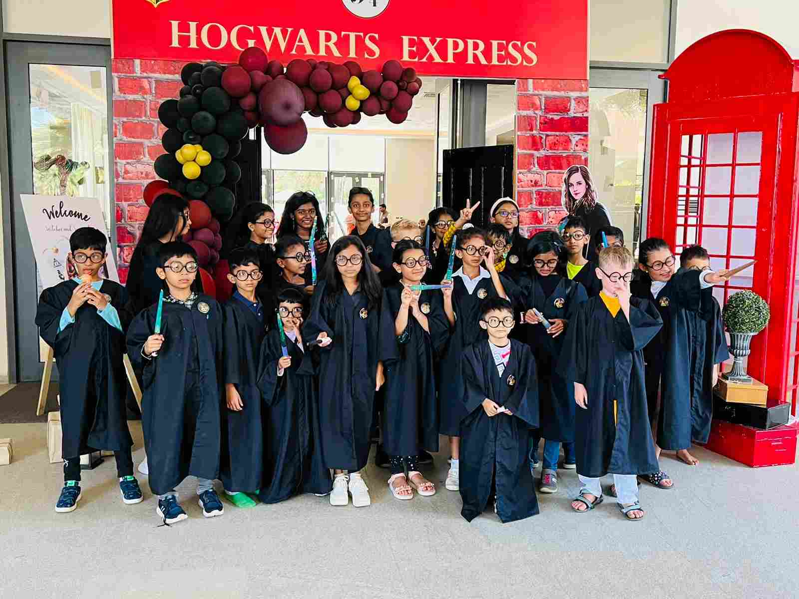

+++
title = 'Januari'
date = 2023-01-29T00:00:00+00:00
draft = false
+++

 Januari började med skördefest i mitten av Januari. Plötsligt var kossorna lite mer spännande till och med för oss. Och så är tjuren tillbaka på sin plats.
 

 Dessutom så höll jag en presentation om svensk konst och kultur. Jag började med
 [isbad](https://www.youtube.com/watch?v=nyuRRWC5GY8) 
 och
 [kulning](https://www.youtube.com/watch?v=KvtT3UyhibQ) 
 med Jonna Jinton som en intro kring dalahästmåleri. Ja, man får syssla lite med mytbildning om sitt eget land när man är långt borta.
 

 Så kom Ingmar, Ulla och Linda på besök för att se en helt vanlig vardagsvecka. Men veckan blev allt annat än vardag när vi hastigt och lustigt fick asfaltering av vägen utanför vårt hus.
 

 Nils hade presentation och föräldrar och släktingar var inbjudna. Ingmar och Ulla åkte dessutom till botaniska trädgården.
 

 Mitt i veckan var vi inbjudna till födelsedagskalas. Värdfamiljen bodde i ett inhägnat villaområde ganska en bit utanför stan där villorna började på 8 miljoner kronor. Nej, det är inte felräknat. I förhållande till typisk köpkraft så är markpriserna här absurda. Kalaset i sig kom dessutom med dussinet personal som skötte catering, trolleri, musik, glass osv. Kostymer till alla barn ingick med. Helt klart i linje med vad en mycket ambitiös person satsar på sitt bröllop i Sverige.
 

 Vi avslutade veckan på The Ananta. Samma trivsamhet som förut, men de kalla nätterna gjorde att vattnet passade mer för korta ihopp än att bara ligga och flyta.
 

 Vi firade Ingmars försenade 70-årsdag med en brasa.
 

## Lite midvinterhumor

 Det är ju mitt i ”vintern” här i Bangalore med, med ganska svala nätter. Precis efter nyår så kom det dessutom lite extra kyliga vindar ner mot norra Karnataka (Delstaten vi bor i), och då gick det ut en mycket allvarlig varning:
 

> Officials have cautioned people against prolonged exposure to cold conditions and advised the wearing of at least 3-4 layers of garments rather than only one or two layers. ”If exposed to cold waves for long hours, people may experience nose bleeding, worsening of asthma, flu symptoms and itchy skin conditions,” an IMD official added. He further said, ”Citizens must cover their heads with woollen caps, remain indoors and wear slippers while inside. Sipping steaming beverages such as tea, coffee or soup is also recommended.”

 Vi skrattde lite gott åt varningen, men prognosen var att nattemperaturerna faktiskt skulle gå ner till bara 5 plusgrader, och det är ju ganska kallt om man bor i ett hur byggt för att suga ut all värme ur luften.
 

 Nu ser vi fram emot hur temperaturerna skall klättra uppåt för att i April ha dygnstemperaturer som på nätterna är 23 grader och på dagarna 35. Lite i varmaste laget för mig, men lite poolbesök och luftkonditionering får lösa den saken.
 

