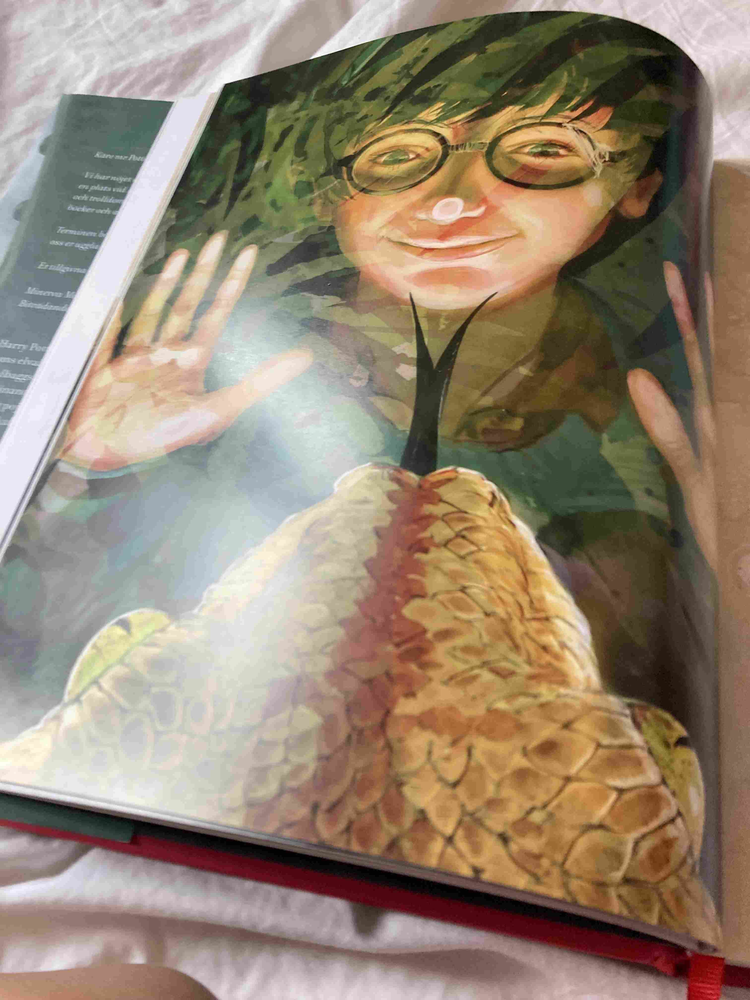
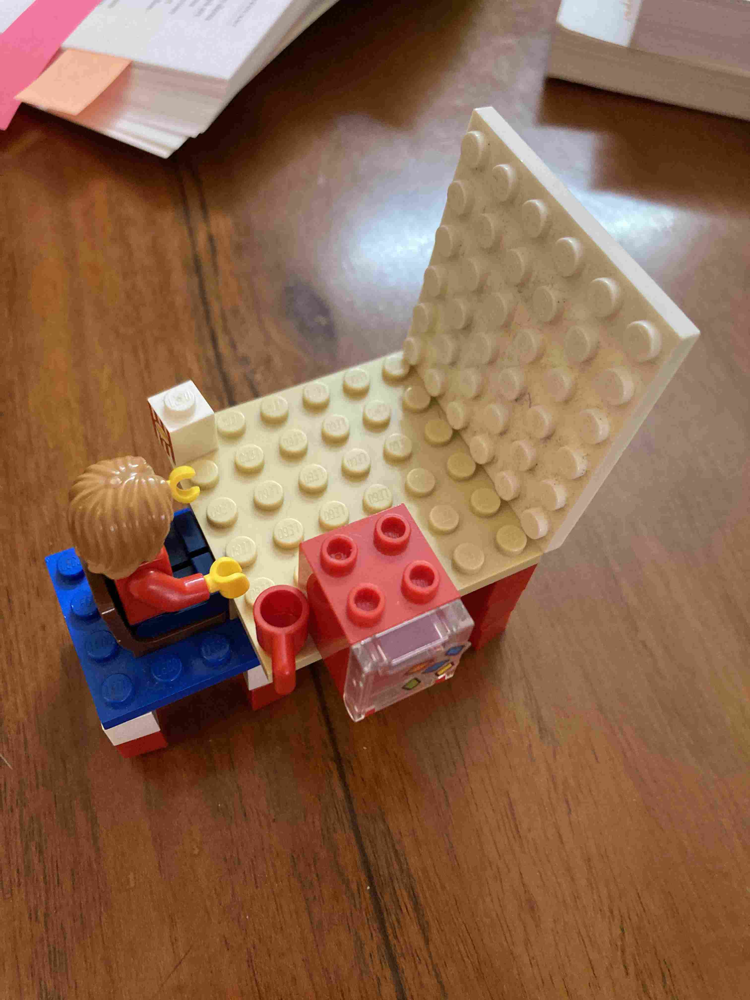

+++
title = 'Vardagsdramatik Och Lite Mindre Dramatik'
date = 2023-02-03T00:00:00+00:00
draft = false
+++

 Det mesta på den här bloggen har i ärlighetens namn varit exotiska turistbilder och en och annan mer eller mindre förnunstig fundering.
 

 Men denna vecka har det hänt grejer!
 

## Vi höll på att bli utkastade ur Indien (Men det är löst nu)

 I slutet på januari så gick våra tillfälliga uppehållstillstånd ut. Att ansöka om en förlängning borde bara ha varit en formalitet. Vi har ju fått både visumen och en första registrering godkända. Men den här gången var det en annan person som tittade på saken och upptäckte att vi var något så exotiskt som personer skickade till Indien men som inte var egenföretagare och inte hate tjänst i Indien. Men enligt en obskyr regel som inte finns med i några listor så skall vi trots allt ha anställningsvisum och inte affärsvisum. Så då blev allt plötsligt väldigt besvärligt.
 

 Men, mina föräldrar har lärt mig väl i hur man hanterar byrokrater, både ärliga paragrafryttare som detta var och de som vill ha pengar (Som jag inte mött någon hittils i Indien till min stora glädje). Så uppklädd enligt elitens alla regler och med ett lugn och ett flöde av öppna frågor och konstruktiva förslag tog jag mig an utmaningen.
 

 Det var rena flaxet att jag faktiskt varit hemma i Sverige i Oktober och därför tekniskt sett inte varit i landet fullt så många månader i sträck. Alltså blev det i slutändan en fråga om bara två månader, och med ett ”Du måste tänka på barnen” och ett heligt löfte om att lämna landet innan midsommar så bestämde han sig att det inte var värt att bråka.
 

 Så nu har vi uppehållstillstånd till slutet av April (När våra visum går ut) och ett muntligt löfte om att kunna köpa ett utresetillstånd då som räcker till slutet av Juni.
 

## Kött på restauranger förbjuds (Men inte av den anledning du tror)

 Tidigare i veckan så skulle jag ta ut min grupp på en kvälls-av. Jag hade valt en känd kedja som serverar en populär grillspetts-buffé. Samma dag så blir jag uppringt och det förklaras att de bara har vegetariskt just nu på grund av någon anledning jag inte förstått. Jag muttrade lite men att boka om i sista sekund kändes jobbigt och alla här är ändå mer eller mindre vegetarianer, så vi körde på.
 

 Väl framme i restaurangen så ser vi en skylt om ”Ingen köttservering på grund av förordningsbeslut.” ?????
 

 Efter ett tag så fick mina kollegor fram att det skall vara en flygplansmässa på det militära flygfältet i närheten. Det hände visst en olycka för något år sedan med en fågel och då har man helt enkelt förbjudit all köttservering på restauranger inom 1 mils avstånd från flygfältet. Argumentet är att köttrestauranger drar till sig fler rovfåglar….
 

 Jag tror ju då att alla råttor som äter de till största delen vegetariska soporna är lika lockande för dem, men vad vet jag?
 

<https://www.indiatoday.in/cities/bengaluru/story/aero-india-2023-non-veg-sale-banned-bengaluru-air-force-station-bbmp-2327415-2023-01-28>

## Vi har börjat läsa Harry Potter (Fast vissa har fuskat)

 Nils har redan tjuvstartat och är nästan klar med första boken, på Engelska. Men som godnattsaga har vi börjat med den här riktigt maffiga boken. Stor och med helsidesillustrationer på nästan varje uppslag är det precis en sådan där magisk sagobok man vill ha. Jag njuter av varje mening.
 

 Bild tagen av Nils
 

## Rebecka pluggar (Eller går hon mest på bio?)

 Isak har tolkat Rebecka där hon sitter och ”pluggar” framför datorn med en kopp kaffe, en ask popcorn och en popcornmaskin. 😛
 

