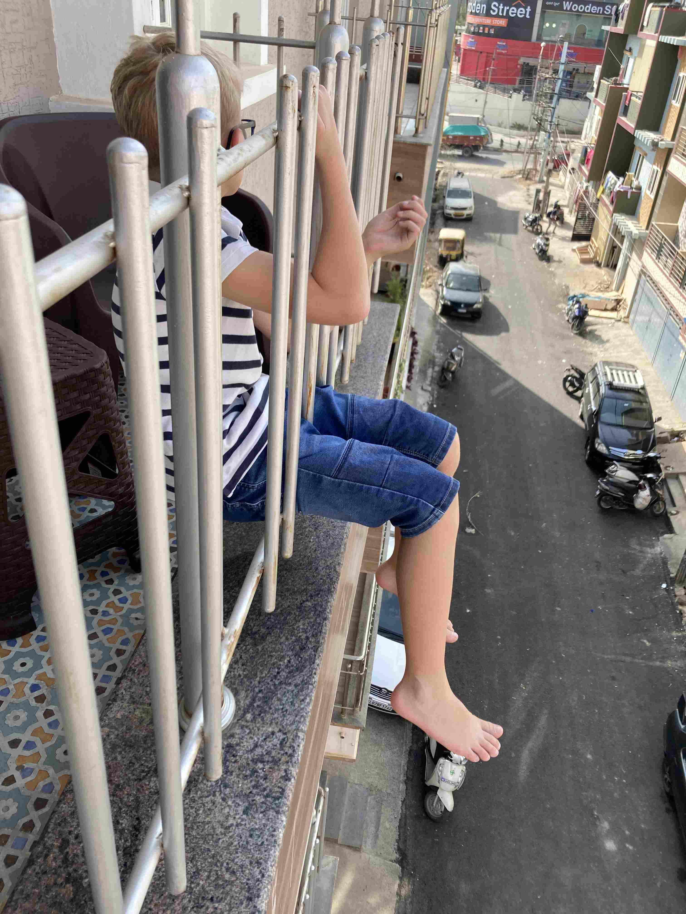
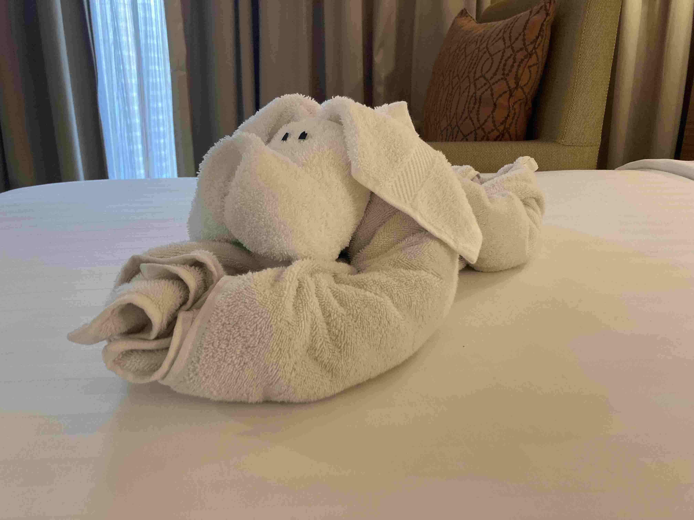

+++
title = 'Skolpjas Och En Helg Som Inte Riktigt Blev Som Vi Tankt Oss'
date = 2023-02-19T00:00:00+00:00
draft = false
+++

 Stora händelse sedan sist var att barnens skola satte upp The Wizard of Oz som musikalteater. Och där sparade de inte på krutet kan man lugnt säga.
 

 Hela pjäsen var närmare 3h lång. Alla barn i hela IB-sektionen i skolan deltog. Några få äldre spelade huvudrollerna och hade enormt mycket repliker. Ett litet förskolebarn spelade hunden Toto i ett genidrag av regissören. Sällan har jag sett någon kliva så lugnt upp på en scen och med så små gester ha en sådan närvaro. Historien bygger ju på att huvudpersonerna möter ett antal samlingar med varelser och varje klass spelade då en av dessa grupper. Högstadiet formade en jättekör, och Gymnasiet skötte logistiken.
 

 Alla icke-kärnämnen ställdes i de sista veckorna i Januari (Till vissas stora besvikelse) och nu har barnen fått lära sig den mindre glamorösa väntande delen av teater. Dyk upp. Vänta några timmar. Gå på scenen och gör något i några minuter. Gå av scenen och vänta tills det hela är slut. Nåväl, inget av våra barn var nog ämnade för scenen i traditionell bemärkelse ändå.
 

 Med lite tur lägger de upp en bra inspelning av pjäsen på internet, men tills dess får ni hålla tilgodo med lite bilder på Nils klass. Pojkarna fick spela soldaterna till Wicked Witch of the East och flickorna spelade The Jitterbugs.
 

 Själv har jag tagit chansen att nytja de lite mindre sjåpiga läkarna här och opererat bort en vårta som jag haft i kanske 5 år. Vi får se om det hjälper. Och så hade vi vänner på besök som gav oss en handbroderad duk i klassisk Indisk stil.
 

 Nu till helgen som var så tänkte vi lyxa till det och slappna av med besök på trampolinlandet som vi varit på några gånger och sedan pool, övernattning och lyxfrukost på ett fint hotell i närheten. Isak passade på att ta Indiskt körkort…..
 

 
 

 Trapolinlandet var precis som väntat, men när vi kommer till hotellet får vi veta att poolen är stängd för renovering. Inga problem, säger de, de har ett systerhotell i närheten och de kan köra oss dit så kan vi använda deras pool. Tyvärr så ser vi direkt när vi kommer till systerhotellet en massa skyltar om att poolen är stängd för renovering och när vi kommer fram till den så är siktdjupet max en halvmeter.
 

 Så det var bara att anlägga den bistra minen och be att få bli tillbakakörda så vi kunde tömma vårt run och checka ut och be dem köra oss till ett annat femstjärningt hotell i närheten. Väl där får vi först veta att man inte kan boka ett rum i receptionen utan bara online. Fram med telefonen och navigering och konstiga menyer så har vi efter ett tag en bokning. Vid det här laget har de tagit lite längre än planerat att komma till poolen och då får vi veta att den stänger om 10 minuter. Phew…..
 

 De säger däremot direkt att vi kan behålla rummet längre dagen efter så då skall väl detta bli bra ändå? Ett snabbt dopp visar att vattnet är riktigt kallt. De måste byta ut vattnet mot brunnsvatten istället för att låta det bara cirkulera i filter för vattnet var kallare än genomsnittstemperaturen senaste veckan.
 

 Men det var ändå läge att gå och äta middag så vi lyxade till det med lång och varm dusch (I vår lägenhet har vi ganska små varmvattenberedare, och vi är fler i familjen som gillar att kunna stå i en fors av varmvatten).
 

 Och som sista grädde på moset så fick jag någon form av lätt magsjuka på natten.
 

 Men, frukosten var en av de bästa vi sett. Rummen och framför allt duscharna var jättebra. Personalen var på tå hela tiden. Så även om det inte blev som planerat, så blev det bra tyckte vi alla.
 

 Och vi har alla trots allt varit mycket, mycket, mindre sjuka här än i Sverige. Jag säger inga siffror för att inte jinxa något, men VAB har inte varit ett större bekymmer här kan vi väl säga.
 

