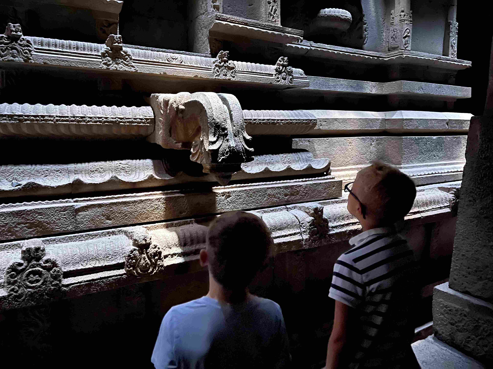
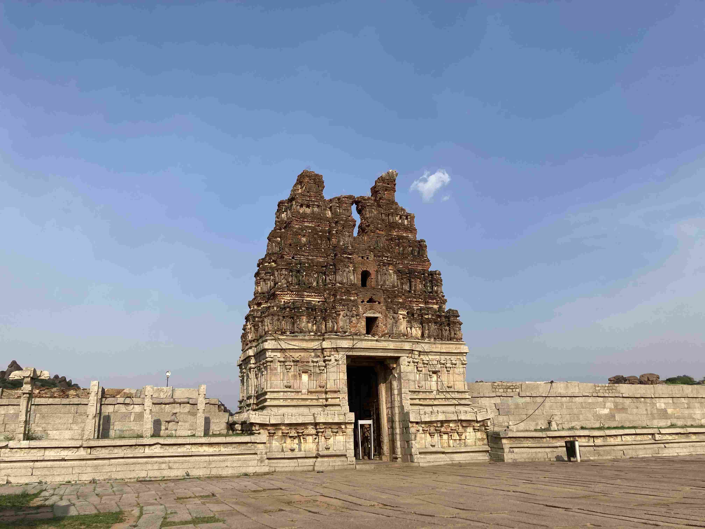
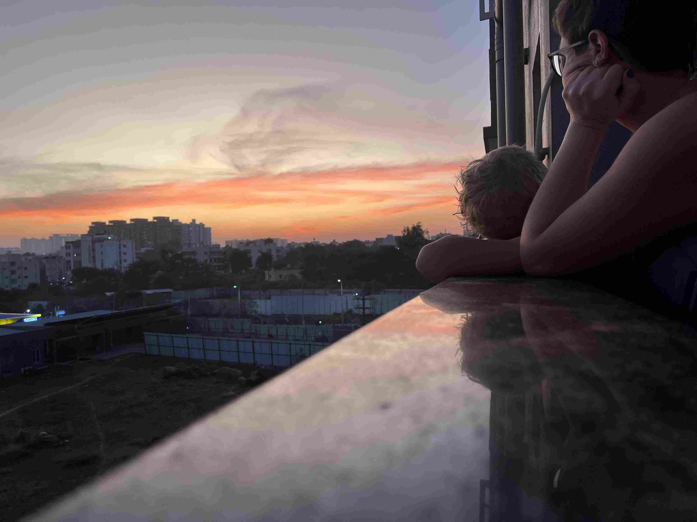

+++
title = 'Pa Upploppet Mot Ett Nytt Liv'
date = 2023-05-20T00:00:00+00:00
draft = false
featured_image = "IMG_4073.jpeg"
+++

 Då är det två veckor kvar av skolan och tre veckor tills vi kommer hem till Sverige och livet som en hemflyttad familj utlandssvenskar.
 

 Senaste inlägget skrevs på den låååååånga tågresan från Bangalore till Goa. Men vi öppnar med ett hopp tillbaka till dagen innan och låter Nils presentera hotellrummet vi bodde i innan vi åkte.
 

 
 

 Den dagen besökte vi också det enorma ISKCON-templet (Mer kända som Hare Krishna). Där gjorde vi det berömda mässandet och gick de 108 stegen och för att komma in i ett tempel helt täckt i guld och takmålningar. Tillbaka på hotellet åt vi en episk Sunday Brunch som Isak har pratat om sedan dess….
 

 Goa var som väntat. Inga nyheter där vilket var precis vad vi ville ha.
 

 Tillbaka i Bangalore så har de vårregnen börjat komma lite mer ordentligt och grönskan har kommit tillbaka efter att det varit ganska savann-likt i några månader. Då passar man också på att baka rågbröd på rågen som man låtit flyga hit, och gör en förvånansvärt god ostkaka på den indiska färskosten paneer. Det gäller att veta vad som är viktigt här i livet.
 

 
 

 Promenadvägen till jobbet har alltid något nytt att visa upp. Denna gång har det flyttat in killingar. Och några barn på sommarlov (Indiskt sommarlov är April/Maj) har också upptäckt att vi går förbi deras hus varje dag och möter oss med glada tillrop och nyplockade blommor. ”Hello Auntie! Hello Uncle! Bye Auntie! Bye Uncle!!”
 

 Vi behöver också ta med en bild på den enorma Jesus vi går förbi nu när de gallrat träden framför så att man ser den….
 

 Och den tillitsövning som alla hundar gör när de helt ogenerat lägger sig att sova mitt på trotoaren. Men här skulle ingen drömma om att trampa på en stackars hund eller krocka med en kossa, så det är helt motiverat att ligga och sova så här.
 

 Isak och Nils var med i en simtävling mot de andra internationella privatskolorna. Åldersindelningen var ganska grov, så Nils tävlade mot femteklassare och hade lite svårt att mäta sig. På bara 50 meter så kan muskler kompensera för brist på teknik. Men Isak knep i alla fall ett brons i stafetten och fick medalj av rektorn.
 

 Isaks klass hade dessutom en uppvisning om Mindfullness för hela skolavdelningen.
 

 
 

 Vi har lite brist på barnvakter här (Ja, om man inte räknar de legioner av nannys man kan anställa, förstås) så Rebecka och jag har inte gjort så mycket på egen hand på kvällarna. Men Bangalores första restaurang med stjärnambitioner har den goda smaken att servera lunch. Så vi har ätit den sort lunch man får när Indier, tränade på 3-stjärniga restauranger i Europa, kommer hem och gör fusion.
 

 Ja, det var så subtilt och gott som det ser ut. Ja, myrorna är fire ants och smakade därefter.
 

 Precis när vi tänkt att vi nog gjort det mesta vi kommer göra här så kom en före detta kollega förbi kontoret och bjöd till ”threading ceremony” för hennes 6-åriga son, vilket motsvarar ungefär vårat dop.
 

 Dryga 5 timmars resa från Bangalore var det rent ut sagt nästgårds med Indiska mått mätt. I samma område ligger Hampi var världens näst största stad efter Beijing på 1500-talet, och enligt vissa den relativ sett rikaste staden som någonnssin funnits. Templet som ser ut som en kärra är en riktig cliche i allt turistmaterial här.
 

 Så vi ringde vår favorittaxichaufför (Som har en bil vi kan ha både säkerhetsbälte och bilkuddar i), fyllde på med åksjuketabletter och…. håll i er nu… bokade rum på vad som fram till 1996 var det kungliga slottet för Maharajan av Sandur. Jag låter bilderna tala för sig själva.
 

 Den röda leran är järnmalm som är den stora industrin i denna del av landet.
 

 Hampi var över förväntan. Efter några besvikelser med turistmål som varit nedgångna och alldeles skräpiga så var det här något helt annat. Väl bevarat (Inte så svårt när det mesta är byggt i solid granit i golv, pelare och bjälklag), fräscht och rent så var det en riktig höjdare, trots 40 grader och sol.
 

 Så var det till slut dags för threading ceremony. Jag skall erkänna att vi inte riktigt förstod så mycket av själva ceremonin. Den började dessutom redan klockan 6 på morgonen, men alla gäster var inbjudna till mitt på dagen, så vi var mest med på sluttampen och festlunchen efteråt.
 

 Här ser ni också den traditionella Sydindiska maten (ris tillkommer). Lätt, nyttigt, smakrikt och mättande, men lite arbetsamt att göra 5+ såser till varje måltid.
 

 
 

 
 

 Och vi avslutar med lite blandade bilder från vardagen, de flesta tagna av Nils och Isak. Läxor, iPads och hemlevererad mat är på gott och ont en stor del av livet för familjer här i Bangalore.
 

 Och sist en bild på de vägar som vi åkt hittills här. Till detta kommer en flygresa till Malvan och Chivla Beech.
 

