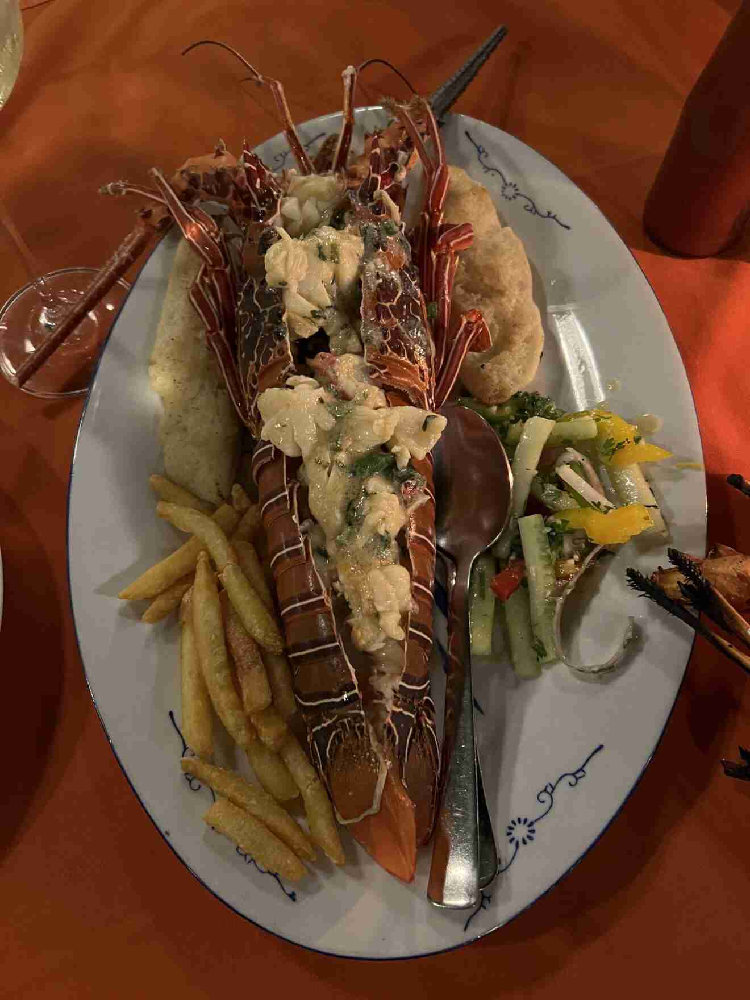
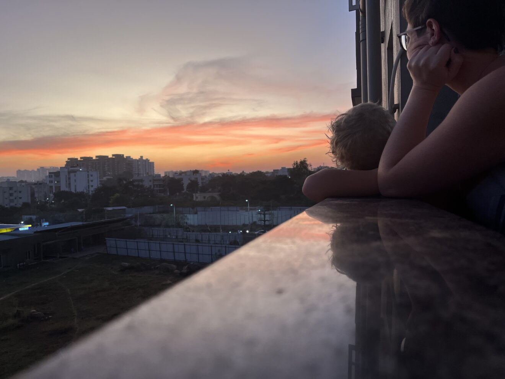
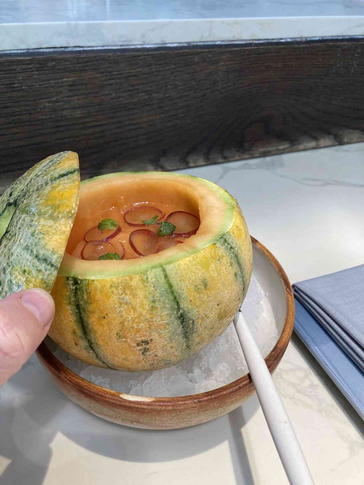
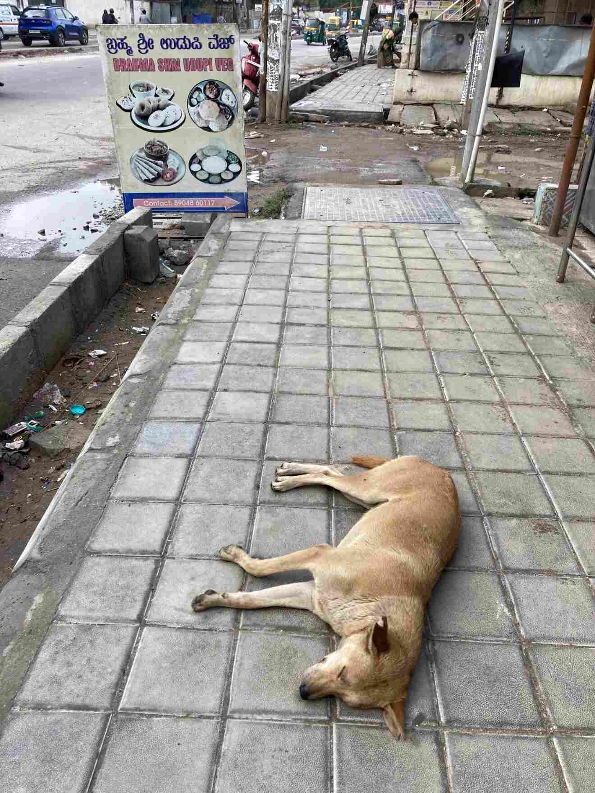

+++
title = 'A Summary In English'
date = 2023-09-05T00:00:00+00:00
draft = false
+++

 This blog was written in Swedish for the benefit of our friends and family back in Sweden. But we met many kind souls along the way and I wanted to summarise our experience with a selection of the pictures that we took.
 

 Visas approved. Turns out that they were the wrong visas, but we managed to get around that in the end.
 

 Corona was still a thing when we arrived. Little does he know the adventure that awaits him….
 

 
 

 Our first cow video. After a few days with dozens of cow sightings every day, we stopped taking pictures or even noticing them.
 

 Gaming in bed. The downside of a huge metropolis is that you spend a lot of time indoors. But computer skills are a part of the future, and they really mastered those.
 

 
 

 Night swim at The Ananta
 

 A clever monkey on Nandi Hills picked upp our almost-finished smoothie and drank the rest. Why eat fruit when you can get it sweetened and preprocessed?
 

 One selfie, please sir…. Looking different from everyone else was quite the experience. Mostly positive but not only.
 

 This chicken was alive 15 minutes ago and is still body temperature inside. It does not get fresher than this 😀
 

 The kadai pan became our favourite kitchen tool. Fresh stir fry that makes the best of Swedish summer food even better. This one is on our shopping list when we get home.
 

 The people who keep the power on are real heroes.
 

 Our favourite downtown restaurant, Sri Krishan the Daba. Lunch is 70 rupees and the staff are delightful.
 

 
 

 Ganesha celebration. I have never seen this much color in one room in my life.
 

 Kids parties with skilled tattoo artists is not something we ever see in Sweden.
 

 
 

 The trampoline park in Electronics city became a regular visit.
 

 When being abroad I claimed that walking barefoot and being connected to the earth was part of my religion. But I never really believed it. But after a few months of not being in a place where I could sit down comfortably on the ground, I started to realise that I had actually spoken the truth. Walking barefoot and lying down on natural ground is a key part of my spirituality and connection to the world around me.
 

 Nobody does Dusshera like Mysore.
 

 
 

 The grooviest lady to ever grip an instrument.
 

 Sundri the tiger. A grand old lady who had not been seen for 3 months when we came upon her on the road.
 

 The Mangifera hotel in Bandipur. Yeah, that lawn was an existential experience for me.
 

 Team plantations in Coonoor
 

 Sunset at Chivla Beach in Mälvan. If you haven’t been there, you are missing out.
 

 Case closed. 😀
 

 
 

 Dance culture in India is head and toes beyond what western culture can achieve.
 

 With practice, the sky is not the limit and you can jump over the sun.
 

 Words not needed
 

 So going to a school with some proper upperclass means you sometimes get to go to a kids birthday party that cost almost as much as your own wedding…. Decorations were nice, though. 😛
 

 Not everything is fun and games. School and school presentations are taken very seriously.
 

 Sunset from our balcony. For an apartment at this price level, the open view and green surroundings were a real luxury.
 

 Family came to visit just in time for our small road to get paved with asphalt. This was a gravel road just a week before.
 

 Us at the start of the 15 hour train ride through the Western Ghats to Mangalore and Karvar. Beautiful in the dry season and supposedly even better during the rains when there are waterfalls everywhere.
 

 
 

 Night life in Bangalore. Not like the quiet cities of Sweden.
 

 Spontaneous lunch with part of the team on Bharat’s last working day.
 

 These are the the trips we made, not counting a few flights to Goa and one to Mälvan.
 

 South Indian tali is completely underrated in the rest of the world.
 

 Hampi really lives up to its name. Granite ages exceptionally well, especially indoors and in the dark like this.
 

 Lower budget for housing in Bangalore left bigger budget for travels and hotels. Like the palace of the Maharaja of Sandur which since some time back is now a hotel, while still preserving most of the original interiors.
 

 Having food as one of our great interests, Rebecka and I of course had to see what the top of the top in Bangalore is. We think we did find it. Here a new-traditional dessert from Kerala.
 

 Traffic may be chaotic, but trust trumps everything. This dog felt rightfully safe that nobody would step on him, even in the morning rush hour.
 

 As the rains came back, so did the greenery. Unfortunately, this large plot will become massive apartment complex soon enough. But we enjoyed the excellent view and fresh air during our time there.
 

 
 

 Our oldest son got picked for the dance performance which was a surprise to all of us given the generally high level of dancing abilities among the kids.
 

 A rainy day traffic stopped completely, so I finally ventured out in Bangalore after dark. It was clear that that is the time Bangalore truly lives.
 

 As we were leaving, some new friends arranged a spontaneous farewell party.
 

 Some more guests who joined on minimal notice.
 

 Last week in India was spent in Goa, where the pool started at about 32 degrees in the morning and topped out at 38 in the afternoon. So this was the most comfortable position halfway out of the water under the shade of the trees.
 

 Bags are packed and we are off to the airport.
 

 Back on Swedish soil and the flowery hills of our native with my parents.
 

 Just to maximise the contrast we went up to the remote mountains. Not a single other person in sight for almost the whole day.
 

 Kids were disappointed to miss the Swedish winder while in India. But far enough up in the mountains, patches of snow can still be found.
 

 Whole family in our traditional dress for Midsummer celebration.
 

 And a final goodbye to Nextory as I leave for new adventures.
 

 
 

 Back in our apartment after over a year away.
 

 
 

 Nils says hi.
 

 And that was all.
 

 Thanks and best wishes!
 

